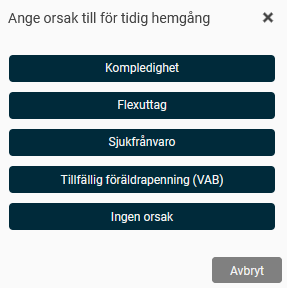
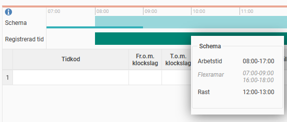

# Varför får jag en fråga om tidig utstämpling trots att jag har flextid?

**Datum:** den 5 december 2025  
**Kategori:** Time  
**Underkategori:** Mobil & Stämpling  
**Typ:** other  
**Svårighetsgrad:** intermediate  
**Tags:** frånvaro, schema, stämpling, tidrapport  
**Bilder:** 2  
**URL:** https://knowledge.flexhrm.com/sv/varf%C3%B6r-f%C3%A5r-jag-en-fr%C3%A5ga-om-tidig-utst%C3%A4mpling-trots-att-jag-har-flextid

---

Om du stämplar ut innan din schemalagda tids slut, kan systemet fråga dig om orsaken till
tidig utstämpling
. Syftet är att att du inte ska missa att registrera eventuell frånvaro.
Frågan kan visas även om du har flextid som gäller hela dygnet. Det beror på hur ditt schema är inställt.
Om din utstämpling sker utanför flexramen för schemats sluttid, räknas det som en tidig utstämpling.

Flexramar och tidig utstämpling
Flexramar ställs in med två intervall: ett för schemats starttid och ett för schemats sluttid. Flexramar 0–12 och 12–24 innebär flextid dygnet runt.
Flexramar 0-24 och 0-24 innebär också flextid dygnet runt.
Exempel
En anställd är schemalagd 8–17, med en timmes rast. Hen börjar arbeta klockan 03:30 och stämplar ut klockan 11:00.
Alternativ 1:
Flexramarna är angivna som
0–12
och
12–24
.
Resultat:
Frågan om tidig utstämpling kommer att ställas.
Alternativ 2:
Flexramarna är angivna som
0–24
.
Resultat:
Frågan om tidig utstämpling kommer
inte
att ställas.
Sker utstämplingen efter kl 12 ställs inte frågan i något av fallen.
Du kan se dina flexramar i din tidrapport. Håll muspekaren över de grafiska tidraderna för att se ramarna.

Får du frågan om tidig utstämpling men inte ska registrera någon frånvaro, väljer du
Ingen orsak
för att slutföra utstämplingen.
