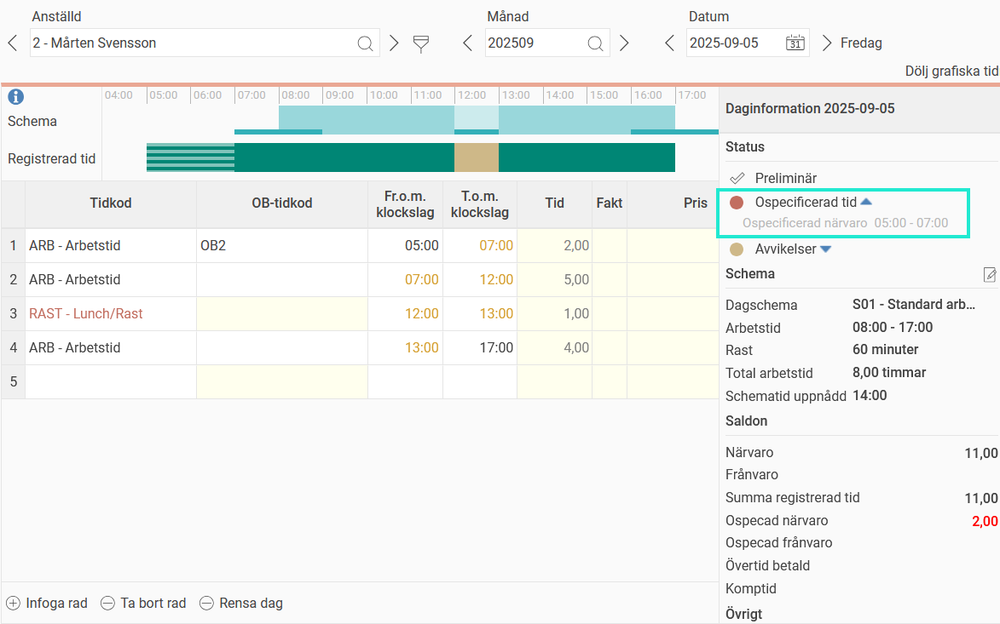
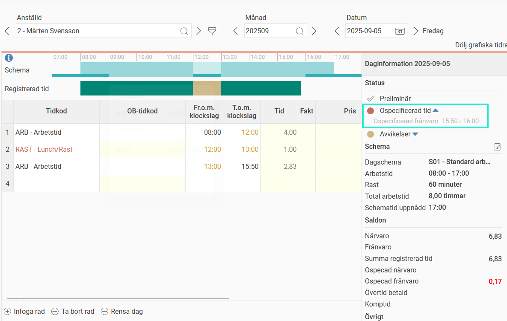

# Varför har jag ospecad tid i min tidrapport?

**Datum:** den 26 september 2025  
**Kategori:** Time  
**Underkategori:** Tidrapportering  
**Typ:** other  
**Svårighetsgrad:** intermediate  
**Tags:** frånvaro, lön, schema, tidkod, tidrapport, övertid  
**Bilder:** 2  
**URL:** https://knowledge.flexhrm.com/sv/varf%C3%B6r-har-jag-ospecad-tid-i-min-tidrapport

---

Ospecificerad tid innebär att din tidrapport innehåller närvaro eller frånvaro som inte följer reglerna för ditt dagschema. Du måste specificera denna närvaro eller frånvaro, till exempel genom att registrera övertid eller frånvaro. HRM Time är ofta inställt på att inte tillåta granskning av tidrapporten när det finns ospecad tid, för att man inte ska missa att registrera allt korrekt innan tiderna går över till lön.
Exempel på ospecificerad närvaro
Låt oss säga att du är schemalagd mellan
08:00–17:00
och du har möjlighet att arbeta in flextid från
07:00
.
Om din tidrapport visar att du har stämplat in redan klockan
05:00
men inte har markerat tiden mellan
05:00–07:00
som övertid, kommer dessa två timmar att visas som ospecificerad närvaro.
Gör du en övertidsmarkering och det finns övertidsregler som täcker dessa två timmar kommer den ospecade tiden att försvinna, och det går bra att granska tidrapporten.

Exempel på ospecificerad frånvaro
Du är schemalagd mellan
08:00–17:00
och har möjlighet att ta ut flextid från
16:00
.
Om du stämplar ut redan klockan
15:50
kommer tiden mellan
15:50–16:00
att bli ospecificerad frånvaro. För att uppfylla reglerna för ditt dagschema måste du specificera dessa tio minuter, till exempel med en frånvarotidkod.

