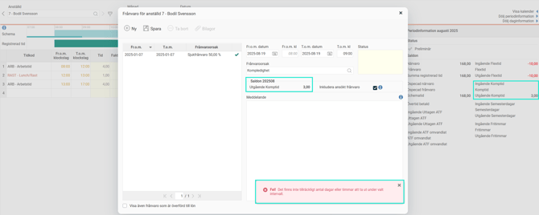

# Varför spärras min frånvaroansökan trots att det finns tillräckligt mycket i det utgående saldot?

**Datum:** den 27 november 2025  
**Kategori:** Time  
**Underkategori:** Frånvaro & Semester  
**Typ:** other  
**Svårighetsgrad:** intermediate  
**Tags:** frånvaro, saldo  
**Bilder:** 1  
**URL:** https://knowledge.flexhrm.com/sv/varf%C3%B6r-sp%C3%A4rras-min-fr%C3%A5nvaroans%C3%B6kan-trots-att-det-finns-tillr%C3%A4ckligt-mycket-i-det-utg%C3%A5ende-saldot

---

Det går att visa saldon i frånvarohanteraren. Man kan till exempel visa kompsaldo vid ansökningar som gäller kompledighet, för att du ska se hur mycket tid det finns att ta ut. Det går också att spärra ansökan vid ett visst saldovärde, för att man inte ska råka ta ut för mycket. Spärras frånvaroorsaken Kompledighet vid saldovärde 0 och du har tre timmar i ditt kompsaldo kan du då inte lägga in en frånvaroansökan som överstiger tre timmar.
Exempel
I exemplet nedan har anställd 5 tre timmar utgående komp i augusti, men kan ändå inte spara ansökan som gäller en timme 19 augusti.

Det beror på att de tre timmarna utgående komp är inlagda via en saldojustering. Saldojusteringen skriver upp det utgående värdet med tre timmar. Eftersom det gäller det utgående värdet gäller det inte förrän utgången av 31 augusti, vilket gör att det inte går att utnyttja 19 augusti.
Om saldojusteringen hade skrivit upp det
ingående
värdet med tre timmar hade det fungerat att ta ut dessa 19 augusti.
Samma sak gäller vid intjänande av värde till saldot under perioden. Har du en händelse för ATF som lägger ut ett värde den sista dagen i perioden kan du inte ta ut detta i ledighet under samma period. Eftersom händelsen sätter periodens utgående värde kan du använda det först kommande perioder.
Du ser på fliken
Ersättningar
att och på vilket datum en händelse fallit ut.
