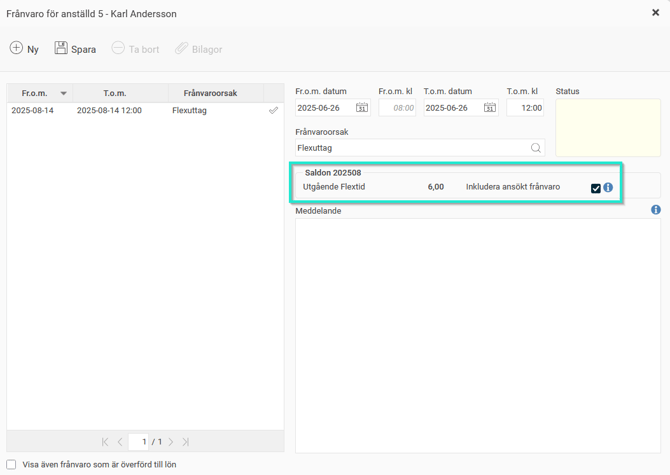
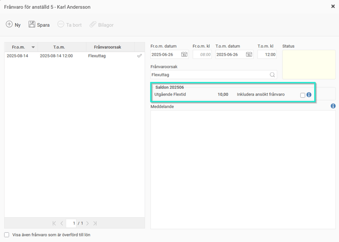
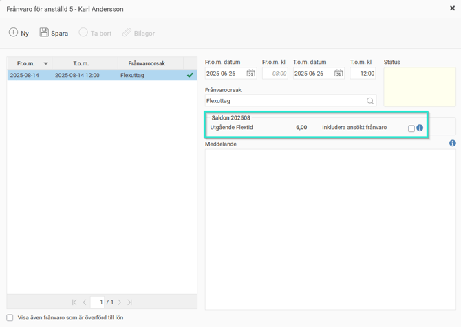

# Varför visas ett framtida saldo i frånvarohanteraren?

**Datum:** den 18 augusti 2025  
**Kategori:** Time  
**Underkategori:** Frånvaro & Semester  
**Typ:** other  
**Svårighetsgrad:** intermediate  
**Tags:** frånvaro, ob, saldo, semester  
**Bilder:** 3  
**URL:** https://knowledge.flexhrm.com/sv/varf%C3%B6r-visas-ett-framtida-saldo-i-fr%C3%A5nvarohanteraren

---

Vid frånvaroansökan kan det underlätta att se saldon för att veta hur mycket frånvaro som går att ta ut. Saldot visas för aktuell månad, men ibland visas ett framtida saldo. Här förklarar vi vad det beror på.
När du ansöker om semester eller flexuttag kan det underlätta att se hur många dagar/timmar du har kvar i saldot. Visar man saldon i frånvarohanteraren visas värdet för aktuell period, om du inte har framtida frånvaro. I sådana fall visas den senaste framtida period där du har något som påverkar saldot.
Exempel
Här visar vi saldo för flextid vid ansökan om flexuttag. Det finns en obehandlad ansökan (fyra timmar flexuttag) i augusti.
När du ansöker om flexuttag i juni visas saldot för augusti om du väljer att visa ansökt frånvaro.

Väljer du att inte visa ansökt frånvaro visas saldot för juni, eftersom det inte finns någon framtida post som påverkar saldot.

Är ansökan i augusti beviljad visas alltid saldot för augusti, eftersom det senaste som påverkar saldot finns i augusti.

