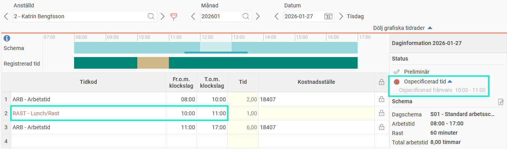

# Varför visas inte ospecificerad frånvaro vid otillåten rast?

**Datum:** den 27 januari 2026  
**Kategori:** Time  
**Underkategori:** Tidrapportering  
**Typ:** other  
**Svårighetsgrad:** intermediate  
**Tags:** frånvaro, schema, stämpling, tidkod, tidrapport  
**Bilder:** 1  
**URL:** https://knowledge.flexhrm.com/sv/varf%C3%B6r-visas-inte-ospecificerad-fr%C3%A5nvaro-vid-otill%C3%A5ten-rast

---

Om du registrerar rast på en annan tid än vad schemat anger, kan systemet markera detta som ospecificerad frånvaro. Det finns dock flera anledningar till att denna markering ibland uteblir.
I HRM Time styrs raster av specifika regler i dagschemat. Dessa regler avgör när under dagen du kan ta rast och hur stämplingar ska tolkas.
Vi kan som exempel ta ett dagschema med arbetstid 08:00-17:00 och rast 12:00-13:00. Rasten är inlagd med rastfönster 11:30-13:30. Det innebär att en utstämplingar som görs mellan kl 11:30-13:30 blir rast, och att det går bra att ta sin rast någon gång mellan kl 11:30-13:30. Skulle man ta ut rast kl 10:00-11:00 genereras ospecificerad frånvaro, eftersom det inte är inom ett rastfönster.

När genereras inte ospecificerad frånvaro?
Det finns tre vanliga orsaker till att systemet inte skapar ospecificerad frånvaro trots att rasten avviker:
Inställning på tidkoden:
Tidkoden för rast kan vara inställd på att inte generera ospecificerad frånvaro.
Inställningen heter
Generera ospecificerad frånvaro vid otillåten rast
och finns under
Inställningar > Tid och Bemanning > Tidkoder.
Inställning på dagschemat:
Själva dagschemat kan ha en inställning som gör att ospecificerad tid inte skapas.
Inställningen heter
Generera ospecificerad tid
och finns under
Inställningar > Tid och Bemanning > Scheman > Dagscheman
Överlappning med rastfönstret:
Om någon del av din rast inträffar inom rastfönstret, skapas ingen ospecificerad frånvaro för rasten. Detta gäller även om den största delen av rasten ligger utanför fönstret.
Exempel:
Ditt rastfönster börjar klockan 11:30 och du tar rast klockan 11:00–12:00. Du får inte någon ospecificerad frånvaro. Detta beror på att den sista halvtimmen är inom rastfönstret.
Tips: Avvikelse för avvikande rast
Även om systemet inte skapar ospecificerad frånvaro, kan du ställa in att se en avvikelse i tidrapporten för "avvikande rast". Den visas när rasten går utanför rastfönstret, även när någon del av rasten är inom rastfönstret.
Avvikelser ställs in per företag, per tidgrupp eller per anställd.
