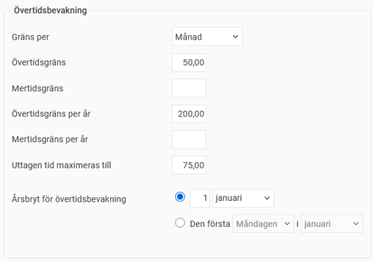

# ⚙️Vilka inställningar behöver göras för övertidsbevakning?

**Datum:** den 26 september 2025  
**Kategori:** Time  
**Underkategori:** Tidrapportering  
**Typ:** config  
**Svårighetsgrad:** intermediate  
**Tags:** mobil, ob, tidkod, tidrapport, övertid  
**Bilder:** 2  
**URL:** https://knowledge.flexhrm.com/sv/vilka-inst%C3%A4llningar-beh%C3%B6ver-g%C3%B6ras-f%C3%B6r-%C3%B6vertidsbevakning

---

Inställningar för panel på startsidan och för påminnelse vid uppnådd gräns.
Inställningar
Behörighet
Påminnelse
Med övertidsbevakningen i Flex HRM kan du enkelt hålla koll på den anställdes övertid så att du inte beordrar mer övertid än vad som är tillåtet.

Inställningar
Du kan ställa in regler för övertidsbevakningen utifrån ert kollektivavtal. Inställningarna för övertidsbevakning hittar du under
Inställningar > Tid och Bemanning > Tidgrupper > fliken Tid
. Ange hur mycket övertid/mertid man får ha per period och år, samt hur mycket tid som kan räknas bort vid uttagen komptid. Periodgränsen kan gälla per månad, två månader eller vecka.

Om det finns avtal för anställda som tillåter övertidsdispens, kan du registrera detta per anställd under
Anställdaregistret > fliken Tid
.
Under
Inställningar > Tid och Bemanning > Tidkoder
ställer du in vilka tidkoder som ska räknas som övertid, mertid och uttagen tid i övertidsbevakningen.
Påminnelser för övertid
Du kan ställa in påminnelser som skickas ut som e-post eller notis i HRM Mobile när en anställd passerar en viss övertidsgräns. Du sätter upp påminnelser under
Inställningar > Allmänt > Påminnelser
. När en påminnelse har skickats ut för en anställd som nått den angivna gränsen, kommer Flex HRM inte att fortsätta påminna för samma person.
Behörighet
Den som vill se panelen
Övertidsbevakning
måste ha en roll med behörighet till panelen. I panelen kan användare se de anställda som de har behörighet att se tidrapport för.
Relaterat:
Hur fungerar påminnelser?
Hur fungerar panelen Övertidsbevakning?
