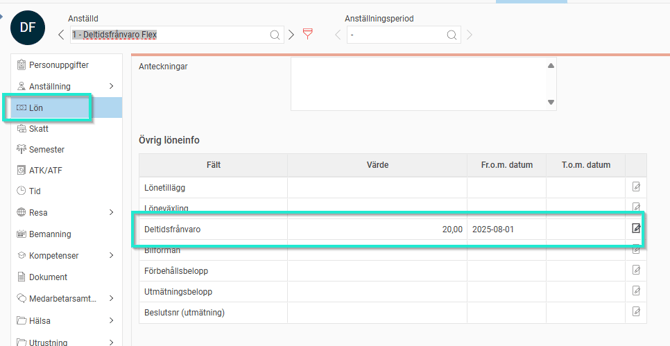
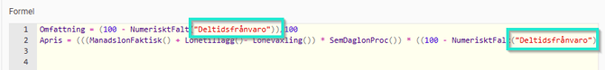

# ⚙️Vilka inställningar i HRM krävs det för att en registrerad deltidsfrånvaro i HRM Time ska blir korrekt i HRM Payroll?

**Datum:** den 26 september 2025  
**Kategori:** Time  
**Underkategori:** Frånvaro & Semester  
**Typ:** config  
**Svårighetsgrad:** advanced  
**Tags:** frånvaro, hrm-time, lön, ob, schema, semester  
**Bilder:** 2  
**URL:** https://knowledge.flexhrm.com/sv/vilka-inst%C3%A4llningar-i-hrm-kr%C3%A4vs-det-f%C3%B6r-att-en-registrerad-deltidsfr%C3%A5nvaro-i-hrm-time-ska-blir-korrekt-i-hrm-payroll

---

Detta artikel avser främst kunder som använder Flex HRM Time med  Flex HRM Payroll. Om annat lönesystem används, styrs inställningarna av det systemets möjlighet att hantera deltidsfrånvaro. Var uppmärksam på deltidsfrånvaro, särskilt i kombination med annan frånvaro, då hanteringen kan skilja sig åt beroende på lönesystem. Deltidsfrånvaro avser perioder med tillfälligt minskad schematid p.g.a. tjänstledighet eller sjukintyg. Enstaka sjukdagar eller del av dag räknas inte som deltidsfrånvaro. Under sjuk-OB-perioden ska deltidsfrånvaro ej användas. Den ska endast rapporteras efter de första 14 dagarna vid långvarig sjukfrånvaro.
Så här anger du deltidsfrånvaroprocent på anställda i HRM Payroll
1. Öppna Anställdaregistret.
2. Ange deltidsfrånvaroprocenten (t ex 20 vid 20 % frånvaro) under Fliken Lön.

3. Systemet hämtar procentsatsen automatiskt till beräkningar i lönearter, exempelvis för semesteravdrag. Detta gör att semesteravdraget minskas om ett sjukavdrag görs samma dag. Formel enligt nedan ska användas.

Tips:
Vill du läsa om övriga inställningar i systemet som berör
deltidsfrånvaro
så klicka här.
