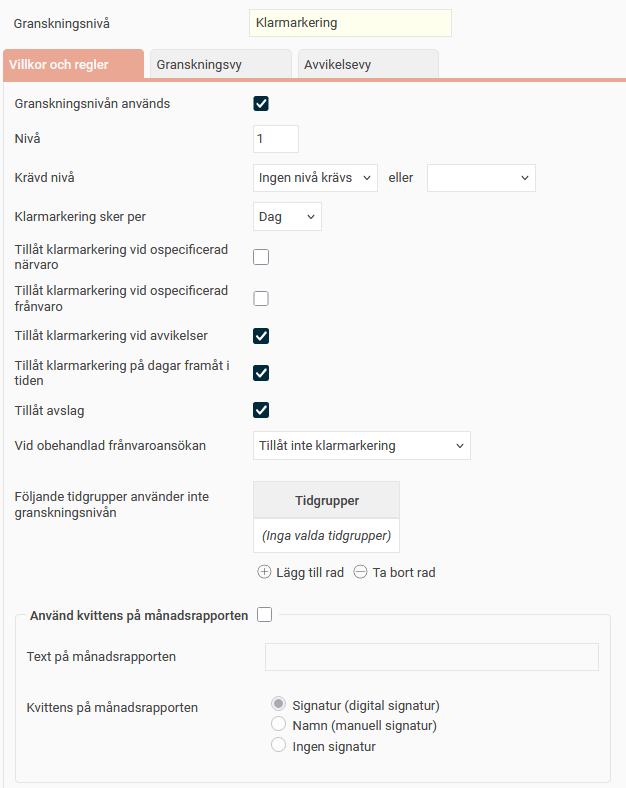
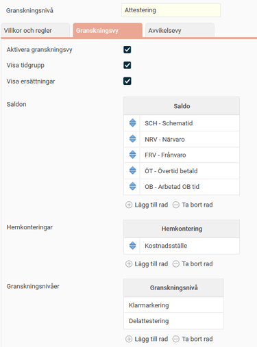
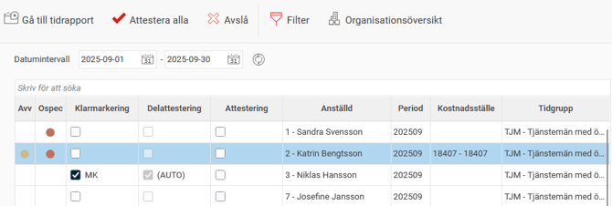
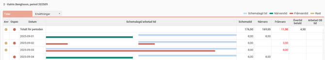
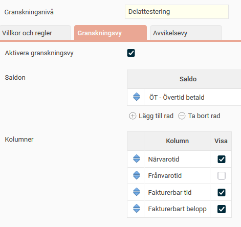
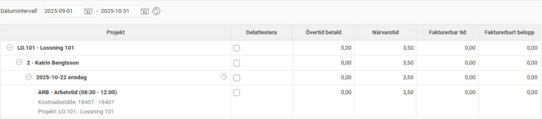

# ⚙️Vilka inställningar kan göras för granskning av tidrapporter?

**Datum:** den 22 oktober 2025  
**Kategori:** Time  
**Underkategori:** Inställningar  
**Typ:** config  
**Svårighetsgrad:** intermediate  
**Tags:** attestering, frånvaro, lön, ob, saldo, semester, tidkod, tidrapport  
**Bilder:** 6  
**URL:** https://knowledge.flexhrm.com/sv/vilka-inst%C3%A4llningar-kan-g%C3%B6ras-f%C3%B6r-granskning-av-tidrapporter

---

I Flex HRM kan du ställa in olika granskningsnivåer för tidrapporter. Denna artikel beskriver de inställningar du kan göra under
Inställningar > Allmänt > Granskningsnivåer > Tidrapporter
.
Om du vill se ett exempel på hur du sätter upp granskningsnivåerna rekommenderar vi artikeln:
Hur ställer jag in granskning av tidrapporter?
Grundläggande förutsättningar
Granskningsnivåer
Du skapar de tillgängliga granskningsnivåerna under
Allmänt > Granskningsnivåer > Tidrapporter
. Alla företag i er databas kan sedan välja att använda dessa nivåer, men de måste inte göra det.
För varje nivå ställer du in benämning,
färg och e
ventuellt en beskrivning
Granskningsnivåerna blir sedan valbara för alla företag. Du ställer in per företag vilka nivåer som ska användas och hur de ska fungera under
Inställningar > Allmänt > Granskningsnivåer > Tidrapporter
.
Behörighet för granskning och vyer
Behörigheten att granska tidrapporter ställs in per roll under
Användare/Behörigheter > Roller
. Det finns en inställning för att få granska och en behörighet för att få tillgång till granskningsvyn.
Det vanligaste är att du har behörighet både att granska och till granskningsvyn.
Om du är behörig att attestera, men inte till attesteringsvyn, kan du endast attestera direkt i tidrapporten.
Om du är behörig till vyn men inte till att attestera, kommer du inte att se anställda i attesteringsvyn.
Granskning per tidrad kräver också behörighet att granska konteringar. Läs mer i denna artikel:
Vilka inställningar krävs för delattestering av tidrader?
Villkor och regler

På fliken
Villkor och Regler
kan du göra följande inställningar:
Granskningsnivån används
Välj om den aktuella granskningsnivån ska användas eller inte vid bearbetning av företagets tidrapporter.
Nivå
T
illdela
granskningsnivån ett ordningsnummer. Detta nummer bestämmer i vilken ordning nivån ska visas i systemets olika funktioner. Om du till exempel vill att attest bara ska kunna göras när en tidrapport är klarmarkerad, måste attestnivån ha ett högre ordningsnummer än klarmarkering.
Krävd nivå för att granska
Här anger du vilken granskningsnivå som eventuellt måste uppnås innan du kan gå vidare med den aktuella nivån.
Exempel:
Du kan ange att tidrapporten måste vara
Klarmarkerad
innan den kan attesteras.
Om du anger två nivåer, till exempel
Klarmarkerad
eller
Godkänd
, räcker det att tidrapporten är antingen
Klarmarkerad
eller
Godkänd
för att den ska kunna attesteras.
Granskar ni i flera steg, till exempel att klarmarkerade tidrapporter först godkänns och sedan attesteras, anger du
Godkänd
som krävd nivå för
Attestering
. Eftersom Godkänd-nivån i sig kräver klarmarkering, får du med den kravnivån automatiskt.
Granskning sker per
V
älj om granskningen ska göras per
d
ag, period
eller
t
idrad
.
Dag
: Tidrapporterna kan granskas en dag i taget.
Period
: Tidrapporterna kan granskas för en hel period i taget (en vecka eller månad, beroende på vald periodtyp).
Tidrad
: Tidrapporterna kan granskas per tidrad. Detta kan vara användbart om till exempel en projektledare ska attestera alla tider som arbetats på ett specifikt projekt, eller om en butikschef ska attestera alla tider som jobbare i den butiken oavsett vem som jobbat där.
Tillåt granskning vid ospecificerad närvaro
M
arkera detta fält om tidrapporter som innehåller ospecificerad närvaro ska kunna granskas. Ospecificerad närvaro kan uppstå till exempel om en person arbetar övertid men inte markerar detta som övertid.
Tillåt granskning vid ospecificerad frånvaro
Markera detta fält om tidrapporter som innehåller ospecificerad frånvaro ska kunna granskas.
Tillåt granskning vid avvikelser
Markera detta fält om tidrapporter som innehåller avvikelse ska kunna granskas. Vad som ska ge avvikelser ställs in per företag/tidgrupp/anställd. Det kan till exempel handla om övertid, frånvaro eller avvikande rastregistrering.
Tillåt granskning på dagar framåt i tiden
D
e
n
na inställning (som är aktiverad som standard) ger möjlighet att välja om tidrapporter som innehåller dagar framåt i tiden ska kunna granskas eller inte.
Tillåt avslag
Du kan tillåta att en eller flera dagar i en tidrapport avslås via en ikon i tidrapportvyn/granskningsvyn. Då kan du även skriva en kommentar till den anställde om vad som behöver korrigeras. När ett avslag görs tas alla tidigare granskningar bort och dagen/dagarna får statusen preliminär.
För att kunna använda funktionen måste du markera
Tillåt avslag
på de granskningsnivåer du vill tillåta avslag på. Du kanske till exempel vill tillåta avslag när en dag är
Klarmarkerad
, men inte när den är
Attesterad
.
Vid obehandlad frånvaroansökan
Här ställer du in hur systemet ska hantera fall där någon försöker granska en tidrapport där det finns en obehandlad frånvaroansökan. Genom att aktivera en spärr eller varning kan du förhindra att en tidrapport går hela vägen till lön utan att till exempel semester kommer med.
Följande alternativ finns:
Tillåt granskning utan varning
: Du kan granska tidrapporten utan att få någon information om obehandlad frånvaroansökan under perioden.
Tillåt granskning med varning
: Du kan granska tidrapporten, men du får en varning om det finns en obehandlad frånvaroansökan under perioden.
Tillåt inte granskning
: Du kan inte granska tidrapporten om det finns en obehandlad frånvaroansökan under perioden.
Följande tidgrupper använder inte granskningsnivån
Här kan du ange en eller flera tidgrupper som inte ska använda den aktuella granskningsnivån för sina tidrapporter.
Använd kvittens på månadsrapporten
Du kan ange om det ska skrivas ut en kvittens på månadsrapporten. Om du markerar detta fält kan du ange en valfri kvittenstext på månadsrapporten och v
älja vilken typ av kvittens som ska användas:
digital signatur
,
manuell signatur
eller
ingen signatur
.
Inställningar vid granskning per tidrad
Dessa inställningar visas om du har valt att granskning sker per
Tidrad:
Tillåt granskning oavsett konteringsbehörighet
Markera denna inställning för att ge användarna behörighet att granska alla projekt. Detta kan vara användbart om anställda ska klarmarkera sina tidrapporter per tidrad och du vill slippa sätta behörigheter för alla projekt.
Konteringsdimension för granskning av tidrad
Välj vilken konteringsdimension som ska användas för granskningen. Det är för denna konteringsdimension behörigheter kommer att sättas. Om en projektledare ska attestera sina projekt, väljer du konteringsnivån
Projekt
.
Även rader utan – kräver granskning
Ange om tidrader som saknar vald kontering (den konteringsdimension du valt i fältet ovan) också ska behöva granskas. Det kan till exempel gälla frånvaro eller tid som den anställde inte rapporterat på något projekt.
Även ersättningar/tidkoder på ersättningsfliken kräver granskning
Välj om även ersättningar/tidkoder på ersättningsfliken ska kräva granskning.
Granskningsvy
På fliken
Granskningsvy
väljer du om en separat granskningsvy ska användas och hur den ska utformas. Utan denna vy sker granskningen direkt i tidrapporten. Med vyn får du en separat översikt över de tidrapporter som ska granskas.
I vyn kan du välja att visa:
Tidgrupp
Ersättningar
Saldon
Hemkonteringar
De granskningsnivåer som har använts före aktuell nivå.
Du kan ändra ordningen för
saldon
och
hemkonteringar
med hjälp av de blå pilarna.

Observera:
Vyer för granskning per
Tidrad
kan endast visa saldon, närvarotid, frånvarotid, fakturerbar tid och fakturerbart belopp.

