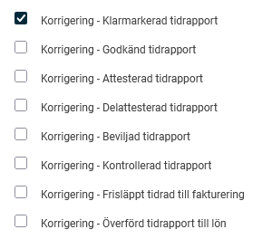
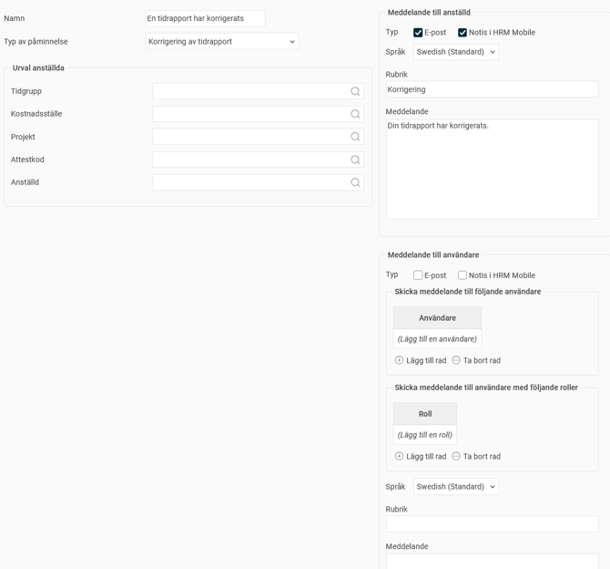

# ⚙️Vilka inställningar kan göras för korrigering av tidrapport?

**Datum:** den 29 september 2025  
**Kategori:** Time  
**Underkategori:** Inställningar  
**Typ:** config  
**Svårighetsgrad:** intermediate  
**Tags:** lön, mobil, ob, tidrapport  
**Bilder:** 2  
**URL:** https://knowledge.flexhrm.com/sv/vilka-inst%C3%A4llningar-kan-g%C3%B6ras-f%C3%B6r-korrigering-av-tidrapport

---

Inställningar för behörighet och påminnelse vid korrigering av tidrapport.
Funktionen
Korrigera tidrapport
gör det möjligt att ändra i en tidrapport som redan är granskad eller överförd till lön. Detta är användbart om du till exempel behöver korrigera en kontering för att få rätt statistik i en rapport, utan att behöva ta bort granskningen eller backa överföringen till lön.
Inställningar för behörigheter
Behörigheten att korrigera en tidrapport kan ställas in för olika granskningsnivåer, samt för tidrapporter som är överförda till lön eller frisläppta för fakturering.
Du kan ställa in behörigheten per roll under
Användare > Behörigheter > Roller
, under noden som heter
Tid
. En chef kan till exempel ha behörighet att korrigera tidrapporter som är klarmarkerade men inte de som är granskade på högre nivåer.

Påminnelse vid korrigering
Det är möjligt att en påminnelse skickas ut när en tidrapport korrigeras. Påminnelsen, som heter
Korrigering av tidrapport
, kan skickas till följande:
Den anställda som tidrapporten gäller.
Alla användare med en specifik roll för den anställda.
En specifik användare.
Om du, som på bilden nedan, ställer in att påminnelsen ska skickas till den anställda via e-post och notis, kommer hen att få e-post och notis i
HRM Mobile
när en korrigering sparas i hens tidrapport.

Relaterat
Kan jag ändra i en tidrapport som är granskad/överförd till lön?
Hur fungerar Påminnelser?
Roller och behörigheter i Flex HRM
