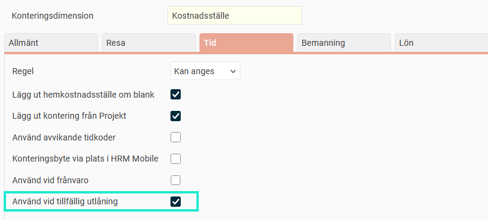
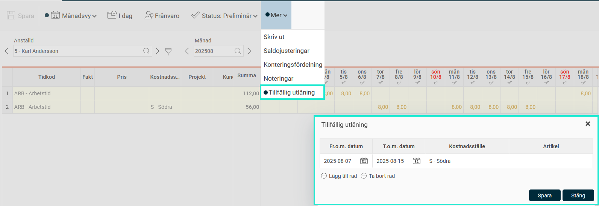

# ⚙️Vilka inställningar krävs för att vi ska kunna använda tillfällig utlåning?

**Datum:** den 29 september 2025  
**Kategori:** Time  
**Underkategori:** Tidrapportering  
**Typ:** config  
**Svårighetsgrad:** intermediate  
**Tags:** tidrapport  
**Bilder:** 2  
**URL:** https://knowledge.flexhrm.com/sv/vilka-inst%C3%A4llningar-kr%C3%A4vs-f%C3%B6r-att-vi-ska-kunna-anv%C3%A4nda-tillf%C3%A4llig-utl%C3%A5ning

---

Inställning per konteringsdimension samt behörighet.
Tillfällig utlåning kan användas för att du i tidrapporten ska kunna ange en eller flera konteringar som under ett valt datumintervall ska falla ut på tidraderna. Det kan t.ex. handla om att hemkostnadsställe i vanliga fall faller ut på tidraderna. Nu ska du inte ändra hemkostnadsställe, men under några dagar vara utlånad. För att slippa det manuella arbetet med att ändra alla tidrader kan du istället ange det tillfälliga kostnadsstället under
Tillfällig utlåning
, så kommer det att falla ut i tidrapporten under det tidsintervall du angett.
Du aktiverar tillfällig utlåning för en eller flera konteringsnivåer under
Inställningar > Allmänt > Konteringsdimensioner > Tid: Använd vid tillfällig utlåning
.

Du måste också ge behörighet till de användare som ska kunna se och ange tillfälliga konteringar. Under
Användare/Behörigheter > Roller
finns
Tillfällig utlåning
under noderna
Tid > Tidrappor
t.
I tidrapporten finns tillfällig utlåning under
Mer.
Finns något inlagt där under aktuell dag/period markeras det med en rund ikon som på bilden nedan.
D
e
konteringar du anger under Tillfällig utlåning ko
mmer att läggas ut i tidrapporten, om ingen annan kontering angetts. Tillfällig utlåning kan användas i både dag- och periodredovisning.

