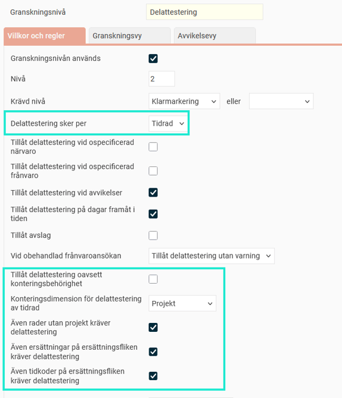
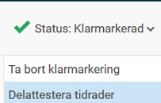
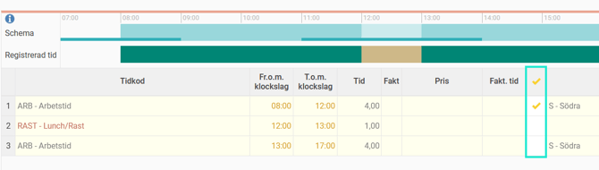
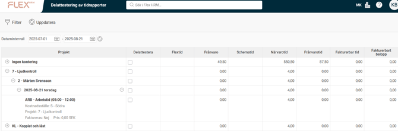
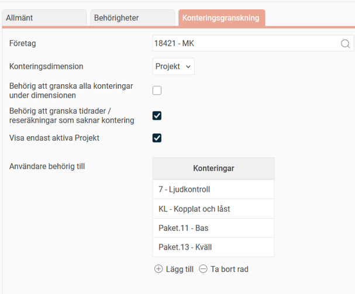

# ⚙️Vilka inställningar krävs för delattestering av tidrader?

**Datum:** den 26 september 2025  
**Kategori:** Time  
**Underkategori:** Attestering & Granskning  
**Typ:** config  
**Svårighetsgrad:** intermediate  
**Tags:** attestering, ob, tidkod, tidrapport  
**Bilder:** 5  
**URL:** https://knowledge.flexhrm.com/sv/vilka-inst%C3%A4llningar-kr%C3%A4vs-f%C3%B6r-delattestering-av-tidrader

---

Granskning per tidrad, inställningar och behörighet.
Inställning granskningsnivå
Delattestering i tidrapport och i granskningsvy
Behörighet
Observera
Granskning per tidrad kallas ofta delattestering, men namnet är inställningsbart. Vi använder benämningen delattestering i artikeln. Det kan heta något annat i ert system.
Delattestering är att granska per tidrad. Ofta klarmarkerar anställda sin tidrapport per dag, en chef granskar tidrader konterade med de projekt han är ansvarig för och en annan chef attesterar tidrapporten för hela månaden.
Det är vanligt att delattestera baserat på tidradernas projekt, men man kan välja att delattestera på vilken konteringsnivå som helst.
Inställning granskningsnivå
Under
Inställningar > Allmänt > Granskningsnivåer > Tidrapporter
ställer du in en nivå på att granska per tidrad. Nivån som ska användas per tidrad måste kräva en annan nivå (ofta klarmarkering). Det går alltså inte att ha delattestering som den första granskningsnivån.
På bilden nedan visas inställning för en nivå vi valt att kalla delattestering. Den ska användas för att granska tidrader baserat på registrerat projekt.

De inringade inställningarna används endast för nivåer som granskar per tidrad, och beskrivs nedan.
Tillåt delattestering oavsett konteringsbehörighet
Markerar du denna inställning kommer användarna att vara behöriga att granska alla projekt. Det kan vara användbart om du vill att de anställda ska klarmarkera sina tidrapporter per tidrad och då vill slippa att sätta behörigheter för alla projekt.
Även rader utan projekt kräver delattestering
A
v
g
ö
r om tidrader utan projekt ska delattesteras. Om du inte kräver delattestering för rader utan projekt räknas en dag som delattesterad så snart den inte har några ogranskade rader där projekt är angivet.
Även ersättningar/tidkoder på ersättningsfliken kräver granskning
Välj här om även ersättningar/tidkoder på tidrapportens flik Ersättningar ska delattesteras.
Delattestering i tidrapport och i granskningsvy
D
et går att delattestera direkt i tidrapporten under status.

Det går att delattestera direkt på varje tidrad i avsedd kolumn. Om ni saknar kolumn för det, kontrollera layoutinställningen för tidrapporten (kan göras på företags-, tidgrupps- eller anställdnivå).

Det finns också en granskningsvy där du kan delattestera i en översikt över alla rader som du är behörig till och som är redo att delattesteras. Du aktiverar denna i inställningarna för granskningsnivån, fliken
Granskningsvy
. Där kan du också ställa in vilka kolumner som ska visas i vyn.

Bra att veta
För att rader ska visas i delattesteringsvyn måste de vara granskade på den nivå som krävs för delattestering (ofta klarmarkering).
Behörighet
De användare som ska delattestera behöver ha en roll som ger dem behörighet för delattestering och till vyn för delattestering. Förutom detta måste du också ställa in vilka projekt varje användare är behörig att delattestera. Detta görs i användarregistret, fliken
Konteringsgranskning
, eller i projektregistret, fliken
Granskning
.
I användarregistret kan du ange enskilda projekt, eller ange att användaren får granska alla företagets projekt. Granskar ni tidrader utan projekt kan du också ange vilka användare som ska få granska sådana rader.

