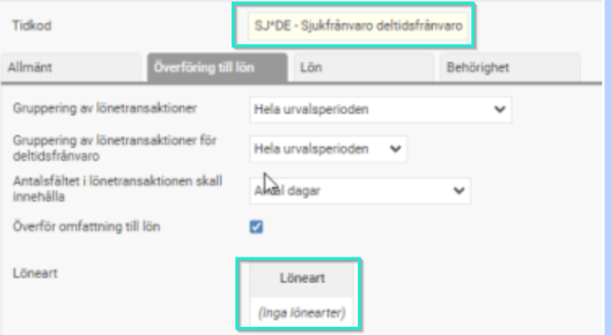
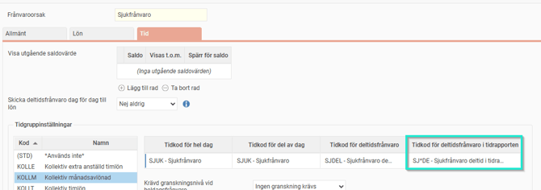
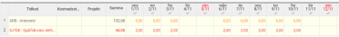

# ⚙️Vilka inställningar krävs i HRM Time för visning av deltidsfrånvaro som en tidkod i tidrapporten?

**Datum:** den 26 september 2025  
**Kategori:** Time  
**Underkategori:** Lön & Överföring  
**Typ:** config  
**Svårighetsgrad:** intermediate  
**Tags:** frånvaro, hrm-time, lön, ob, schema, tidkod, tidrapport  
**Bilder:** 3  
**URL:** https://knowledge.flexhrm.com/sv/vilka-inst%C3%A4llningar-kr%C3%A4vs-i-hrm-time-f%C3%B6r-visning-av-deltidsfr%C3%A5nvaro-som-en-tidkod-i-tidrapporten

---

Inställningar i HRM Time: Visa deltidsfrånvaro som tidkod i tidrapporten
Så här aktiverar du visningen:
Skapa en ny tidkod endast för visning i tidrapporten:
Kopiera din befintliga tidkod för deltidsfrånvaro.
På den nya tidkoden, ta bort kopplingen till löneart under fliken ”Överföring till lön” (så ingen överföring sker till lönesystemet).

Ange tidkod för deltidsfrånvaro i tidrapporten:
Gå in på aktuell frånvaroorsak.
Ange den nya tidkoden under ”Tidkod för deltidsfrånvaro i tidrapporten”.

Resultat i tidrapporten:
Deltidsfrånvaron kommer nu visas som en egen rad i månadsvyn.
Vid fast procent (samma frånvaro varje dag) redovisas frånvaron tydligt.

Vid intermittent schema visas frånvaron per aktuella dagar, men det finns begränsningar (se nedan).
Viktiga begränsningar vid intermittenta scheman
Vissa kombinationer mellan deltidsfrånvaro och intermittent arbetstid kan inte hanteras fullt ut:
Exempel 1:
Arbetar endast 1 dag/vecka (t.ex. måndag 8–17) och har 80% deltidsfrånvaro.
Systemet tolkar heltidsmåttet för måndag som 40 timmar. Detta kan inte fördelas korrekt i tidrapporten utan att tiden ”spiller över” på tider som inte är arbetstid, vilket inte tillåts (maxgräns är till +23.59 nästa dag).
Exempel 2:
Arbetar 2 dagar/vecka (t.ex. måndag 8–15, tisdag 8–10), 80% deltidsfrånvaro.
Systemet kan försöka lägga ut resterande timmar på tider som krockar med faktisk arbetstid, vilket gör att rapporteringen inte fungerar korrekt.
Liknande problem kan uppstå om deltidsfrånvaron överlappar kommande dags arbetstid vid fler arbetsdagar.
Observera!
Kontrollera alltid resultatet i tidrapporten efter att du har gjort dessa inställningar, speciellt om du har anställda med ovanliga eller intermittenta arbetsscheman.
Tips:
Vill du läsa om övriga inställningar i systemet som berör
deltidsfrånvaro
så klicka här.
