# Vilka olika funktioner finns i tidrapporten?

**Datum:** den 18 augusti 2025  
**Kategori:** Time  
**Underkategori:** Tidrapportering  
**Typ:** other  
**Svårighetsgrad:** intermediate  
**Tags:** frånvaro, mobil, ob, saldo, schema, stämpling, tidkod, tidrapport  
**Bilder:** 11  
**URL:** https://knowledge.flexhrm.com/sv/vilka-olika-funktioner-finns-i-tidrapporten

---

En översikt av tidrapporten och en beskrivning av de knappar som hittas i menyraden högst upp.
Översikt tidrapport
Knappar
Översikt tidrapport
Du kan till viss del själv välja vilken information som visas i tidrapporten. För att ge mer utrymme kan du dölja
kalender, daginformation, periodinformation
och
de grafiska tidraderna
vid rapportering.
Kalendern
samt
dag- och periodinformation
fälls in från högra sidan som på bilden nedan.
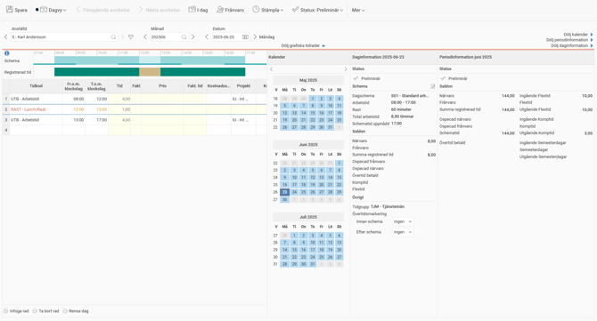
I respektive informationsvy kan du visa/dölja information om eventuell ospecificerad tid och avvikelser genom att klicka på de blå pilarna.
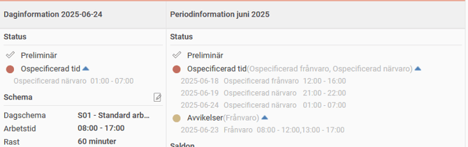
Grafiska tidrader
kan visas i överkant av tidrapporten för att få en mer visuell bild av den rapporterade tiden. Håll muspekaren över
Schema
för att visa schematider för dagen och klicka på
informationssymbolen
för att se en förklaring över de olika färgsättningarna.
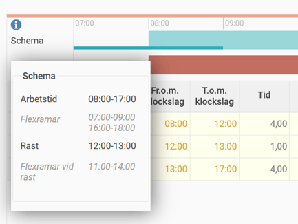
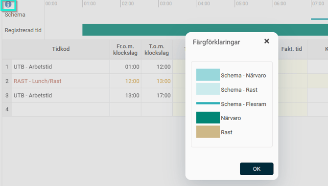
Knappar
Det finns ett antal knappar i menyraden högst upp i tidrapporten. Nedan följer en kort beskrivning av respektive knapp.
Observera
Inställningar för tidrapport och behörigheter kan göra att vissa av knapparna inte visas.
Vi använder nedan begreppet "Klarmarkering" för granskning av tidrapport. Det kan heta något annat hos er.
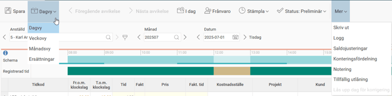
Spara
– Sparar ändringarna i tidrapporten. Så fort en ny vy ska laddas måste ändringarna i den befintliga sparas. Detta gäller även vid byte av datum, vilket innebär att varje dag måste göras klar och sparas innan nästa kan påbörjas.
Dagvy
– För den som rapporterar tiden med klockslag, dvs. dagredovisning, sköts all tidrapportering i denna vy. För en periodredovisare visas denna vy inte alls.
Veckovy
– Visning och summering av din rapporterade tid per vecka.
Månadsvy
– Översiktlig vy över hela månaden för att kunna få en total bild över månadens rapporterade tid. Ta tag i Summa-kolumnen och dra den åt höger eller vänster för att minska respektive öka antalet dagar som syns utan att behöva scrolla.
Markerad rad blir tydligt markerad med en ljusblå ram. I nederkant syns summeringar både per månad och per dag.
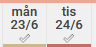
I underkant av varje datum visas en färgkodning för avvikelse eller ospecificerad tid.
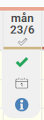
När du klickar på ett datum i vecko- eller månadsvyn kan du välja att gå till dagvyn för dagen, klarmarkera dagen eller visa daginformationen för det aktuella datumet.
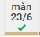
När en dag blivit granskad ändrar granskningsikonen färg.
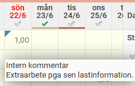
Finns det en kommentar till tidposten markeras detta med en blå triangel i hörnet av cellen.
Ersättningar
– Används för att registrera både ersättningskoder och tidkoder. I denna vy visas automatiskt genererade rader. Dessa går att dölja om de gör det svårt att urskilja manuellt inmatade ersättningar eller tidkoder. Markeringen vid Ersättningar används för att visa att det finns något registrerat i vyn.
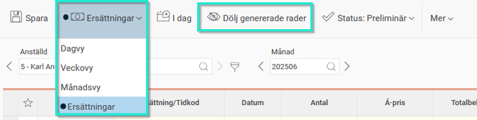
Föregående/Nästa avvikelse -
Används för att bläddra mellan dagar i aktuell period som har avvikelser och/eller ospecificerad tid.
I dag
– Tar dig till dagens datum eller dagens period beroende på vilken vy du befinner dig i.
Frånvaro
– Används för att ansöka om frånvaro eller registrera frånvaro.
Stämpla -
Används för att stämpla tider i realtid som ett alternativ till att manuellt skriva in dem i tidrapporten.
Status -
Visar om tidrapporten/dagen är granskad. Klicka här för att granska tidrapporten.
Mer > Skriv ut -
Utskrift av tidrapportens månadsvy, vilket är detsamma som att skriva ut rapporten Månadsrapport.
Mer > Logg -
En logg över tidrader och stämplingar. Finns endast i dagvyn.
Mer > Saldojusteringar -
Används för att visa och hantera saldojusteringar.
Mer > Konteringsfördelning -
Används för att på ett enkelt sätt fördela tiden på konteringar (projekt, kostnadsställen etc).
Mer > Notering -
Används för att ange en notering för aktuell dag. Noteringen visas i Närvarotablå, Kalender samt Mina kollegor i HRM Mobile.
Mer > Tillfällig utlåning -
Används för att lägga in konteringar (t. ex. kostnadsställe) som under en begränsad period ska läggas ut i tidrapporten.
Filter
– Urvalsmöjligheter för att styra vilka personer som ska synas i listan över anställda.
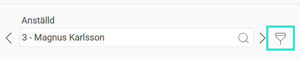
