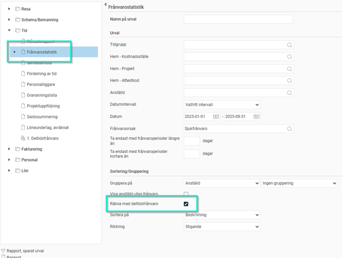
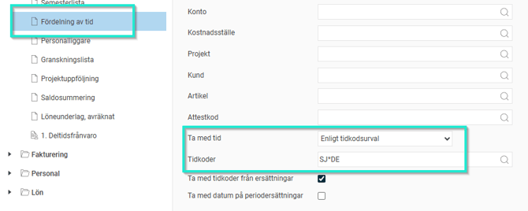
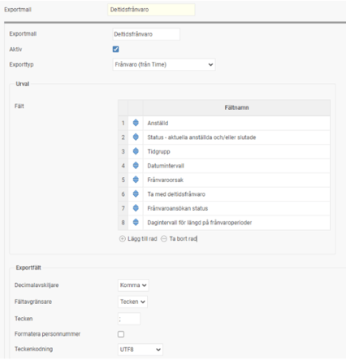
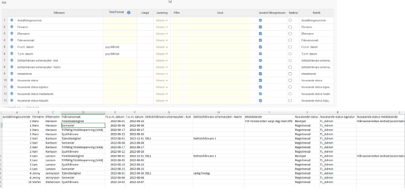
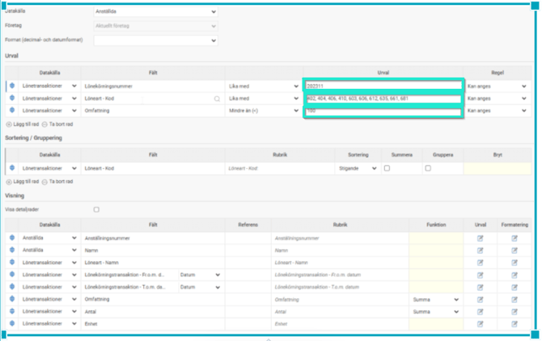

# Vilka rapporter kan man få ut på deltidsfrånvaro?

**Datum:** den 27 augusti 2025  
**Kategori:** Time  
**Underkategori:** Tidrapportering  
**Typ:** other  
**Svårighetsgrad:** intermediate  
**Tags:** frånvaro, lön, tidkod, tidrapport  
**Bilder:** 5  
**URL:** https://knowledge.flexhrm.com/sv/vilka-rapporter-kan-man-f%C3%A5-ut-p%C3%A5-deltidsfr%C3%A5nvaro

---

Rapportuttag kan tas ut på deltidsfrånvaro från följande funktioner i Flex HRM
Standardrapporten - Frånvarostatistik
- Välj datum samt frånvaroorsak
- Markera alternativet "Räkna med deltidsfrånvaro"

Standardrapporten - Fördelning av tid
Om tidkod läggs ut i tidrapporten för visning av deltidsfrånvaro kan standardrapporten Fördelning av tid användas
- Gör urval på tidkoderna för deltidsfrånvaro exempelvis SJ*DE"

Exportmallar - Datakällan - Frånvaro (Time)
Man kan få med deltidsfrånvaro enligt följande exempel på Exportmall

Rapportgeneratorn - Datakälla Anställda/Lönetransaktioner
Rapportgeneratorn kan användas för att ta ut lönetransaktioner med deltidsfrånvaro när dessa lästs över till HRM Payroll. Urval görs på aktuell lönekörning, lönearter för frånvaroavdrag samt omfattning mindre än 100.

Tips:
Vill du läsa om övriga inställningar i systemet som berör
deltidsfrånvaro
så klicka här.
