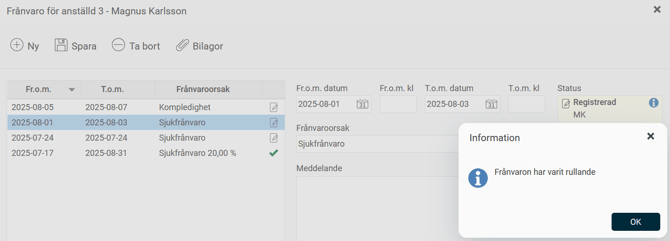

# Vilken frånvaro gäller när det finns överlappande frånvaroposter?

**Datum:** den 18 augusti 2025  
**Kategori:** Time  
**Underkategori:** Tidrapportering  
**Typ:** other  
**Svårighetsgrad:** intermediate  
**Tags:** frånvaro, tidrapport  
**Bilder:** 1  
**URL:** https://knowledge.flexhrm.com/sv/vilken-fr%C3%A5nvaro-g%C3%A4ller-n%C3%A4r-det-finns-%C3%B6verlappande-fr%C3%A5nvaroposter

---

Det går att skapa frånvaroposter som överlappar varandra. I tidrapporten kan frånvaro inte överlappa. 
Denna artikel informerar om hur frånvaro genereras när det finns överlappande frånvaroposter.
Här är vad som gäller i tidrapporten när frånvarohanteraren har frånvaroposter som överlappar varandra:
Om det finns en frånvaro som är rullande (= saknar slutdatum) kommer eventuell annan frånvaro som ligger efter att gälla.
Om det finns en frånvaro som har varit rullande men nu har fått ett slutdatum, kommer den att gälla före andra frånvaro som den överlappar.
Om en frånvaro helt innesluts av en annan genereras den inre frånvaron. Detta gäller endast om båda är heldagar eller om båda är del av dag.
Om inget av fallen ovan stämmer in genereras den frånvaro som är registrerad senast.
Tips:
Det går att se om en frånvaro har varit rullande. Frånvaroposter som varit rullande, men numera har ett slutdatum, får ett info-i som informerar om det. Bilden nedan visar en sådan frånvaro i frånvarohanteraren.

