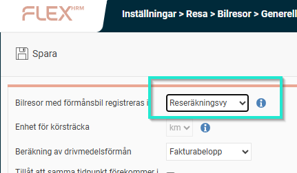
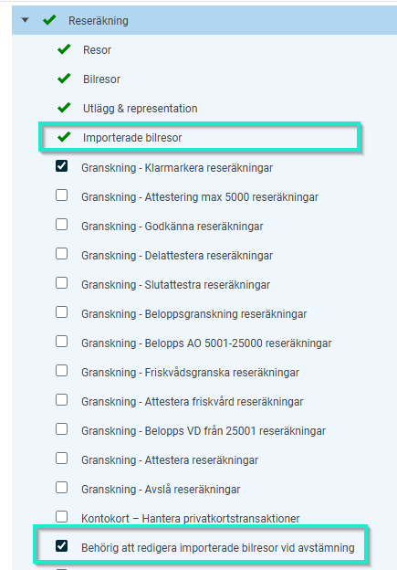
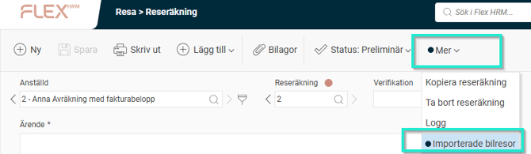
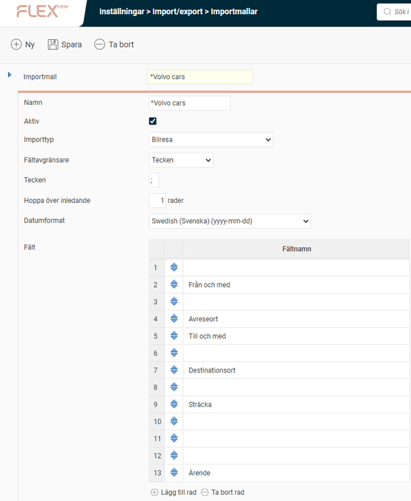
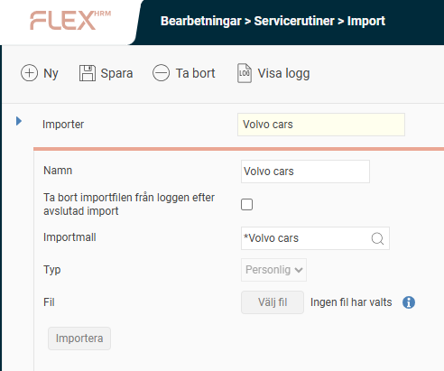

# ⚙️Hur aktiverar vi möjligheten för anställda att importera körjournaler till HRM Travel?

**Datum:** den 1 oktober 2025  
**Kategori:** Travel & Expense  
**Underkategori:** Reseräkningar  
**Typ:** config  
**Svårighetsgrad:** advanced  
**Tags:** bil, resa  
**Bilder:** 5  
**URL:** https://knowledge.flexhrm.com/sv/hur-aktiverar-vi-m%C3%B6jligheten-f%C3%B6r-anst%C3%A4llda-att-importera-k%C3%B6rjournaler-till-hrm-travel

---

För att kunna importera körjournaler från andra system så måste du skapa importmallar för bilresor och körjournaler.
Importera körjournaler
I Flex HRM kan du importera körjournaler från externa leverantörer av elektroniska körjournaler. Importen kan göras antingen från en textfil eller via Flex HRM web-API. Det är också möjligt för dig att importera dina egna bilresor om du har en bil som automatiskt kan registrera körjournaler till en text- eller CSV-fil.
För att kunna använda den här funktionen behöver du en medarbetarroll med rätt behörighet för importerade bilresor. För den här rollen kan du även välja om du ska kunna redigera de importerade bilresorna vid en avstämning.
Ställ in bilresor i HRM Travel
Funktionen
Importera bilresor
kräver att förmånsbilar registreras i
Transaktionsvyn
. Se därför till att den inställningen är på plats.

Det här innebär att anställda som vill använda den inbyggda körjournalen, istället för att importera, måste registrera sina resor i
Transaktionsvyn
. De kan fortfarande använda menyn
Körjournal
för att kontrollera och stämma av registrerade resor.
Användarroll och behörigheter
För att få tillgång till den här funktionen måste du ha en medarbetarroll som ger dig behörighet att importera bilresor. För den här rollen kan du också ställa in om du ska kunna redigera importerade bilresor i samband med avstämning.

Behöriga användare får ett nytt alternativ under menyn
Mer
för att stämma av importerade bilresor.

Skapa en importmall
För att kunna importera körjournaler från en textfil måste du först skapa en
importmall
som beskriver filens format.
Så här gör du:
Gå till
Administration > Inställningar > Import/Export > Importmallar
.
Ange ett namn för mallen och välj om den ska vara aktiv.
Välj importtyp
Bilresa
.
Ange fältavgränsare, till exempel semikolon.
Om filen har en rubrikrad som du vill hoppa över, välj det alternativet.
Om filen innehåller fält som du inte vill importera, till exempel mätarställning, lägger du till dessa som tomma fält i mallen.

En importmall som inte innehåller anställningsnummer kan enbart användas för personliga importer.
Skapa en import
När du har en importmall kan du skapa en import.
Gå till
Administration > Bearbetningar > Servicerutiner > Import
.
Ange ett namn på importen. Det här namnet kommer att visas när du ska importera bilresor till din reseräkning.
Om importmallen innehåller anställningsnummer kan du välja att skapa en personlig eller generell import. Importer som inte har anställningsnummer kan endast vara personliga.
I exemplet nedan så innehåller importmallen inte anställningsnummer och kan sålunda endast vara av Typ "Personlig"

Tips! Vill du läsa hur en anställd importerar en körjournal till en reseräkning?
Klicka här
