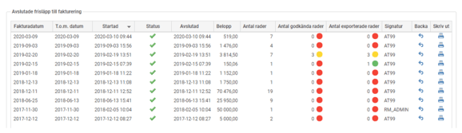

# ⚙️Hur används funktionen "Frisläpp till fakturering i Flex HRM Travel?

**Datum:** den 2 oktober 2025  
**Kategori:** Travel & Expense  
**Underkategori:** Traktamente  
**Typ:** config  
**Svårighetsgrad:** intermediate  
**Tags:** bil, traktamente, utlägg  
**Bilder:** 1  
**URL:** https://knowledge.flexhrm.com/sv/hur-anv%C3%A4nds-funktionen-frisl%C3%A4pp-till-fakturering-i-flex-hrm-travel

---

I denna funktion kan jag frisläppa utlägg, resor eller traktamenten från reseräkningarna som är markerade som fakturerbara. Därmed låses reseräkningarna och ett fakturaunderlag kan skapas.
Frisläpp till fakturering
Under Administration – Bearbetningar – Frisläpp till fakturering.
I denna funktion frisläpps de tider i tidrapporterna och/eller de resor/utlägg i reseräkningarna som är markerade som fakturerbara. Därmed låses tidrapporterna/reseräkningarna och ett fakturaunderlag skapas.
Frisläppet sker enligt de regler som finns angivna under Inställningar – Allmänt –Fakturering.
Ny
Namn på sparat filter
I Flex HRM finns det möjlighet att använda ett sparat filter vid frisläppet till fakturering. I sparade filter kan du använda dynamiska datum, vilket gör att samma filter kan användas flera gånger utan att du behöver göra några ändringar. Här kan du namnge ditt filter och sedan spara det med hjälp av knappen Spara filter nedtill i vyn. Alla filter som sparas i denna vy är personliga och visas endast för den användare som sparat dem.
System
Välj om man vill frisläppa från Time och Travel samtidigt alternativt frisläppa enbart Time e ller enbart Travel.
Frisläpp t.o.m. datum
Ange här t.o.m. vilket datum frisläpp ska göras. Alla tidrader och resräkningsrader till  och med detta datum kommer att frisläppas som inte är frisläppta sedan tidigare. Man kan alltså inte ange något fr.o.m datum.
Fakturadatum
Ange här fakturadatum för de tidrapporter som ska frisläppas. Detta datum är endast en märkning med datum för de rader man frisläpper och påverkar således inte vilka tid- eller reseräkningsrader som kommer att frisläppas.
Frisläpp (knapp)
Klicka här för att starta frisläppet till fakturering.
Urval
Här anges önskade urval för konteringar (exempelvis kostnadsställe, projekt, kunder och artiklar) samt anställda som ska medtas vid frisläpp till fakturering.
Företagsfilter (knapp)
När du klickar på denna knapp får du upp ett fönster där du kan skapa och redigera frisläppsfilter för företaget. Dessa filter visas för samtliga användare som har tillgång till frisläpp till fakturering men ifall de väljer att spara filtret kommer den sparade versionen vara ett personligt filter som inte påverkar andra användare. När du sparat ett frisläppsurval som företagsfilter kan du under Administration – Inställningar – Import/export – Schemalagda körningar skapa en ny schemalagd körning av frisläppet
Avslutade frisläpp till fakturering
Här finner du information om redan avslutade frisläpp.
Fakturadatum
T.om datum
Startad
Status
Avslutad
Belopp
Antal rader
“Antal rader” är antalet rader enligt fakturaunderlaget
Antal godkända rader
Här kan du se hur många rader från ett visst frisläpp som blivit godkända (visas endast om den funktionen används). Du kan även se hur många rader som blivit exporterade.

Antal exporterade rader
Om du inte exporterar fakturaunderlaget till något ekonomisystem utan istället skriver ut fakturaunderlaget för att manuellt lägga in det i ekonomisystemet finns det möjlighet att ställa in så att utskrivna rader i fakturaunderlaget ses som exporterade för att kunna nyttja funktionaliteten ovan.
Signatur
Signatur på användare som startat frisläppet
Backa
Klicka på ikonen i kolumnen Backa om du önskar backa aktuellt frisläpp. De tider som frisläppts vid detta tillfälle läses då tillbaka och eventuella ändringar på dagarna/tidraderna kan göras.
Skriv ut
Tips! Om du vill läsa mer om Fakturering
Klicka här
