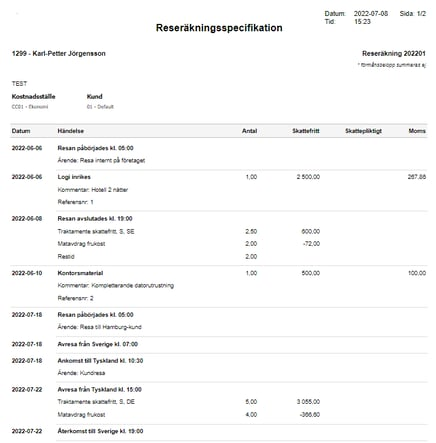
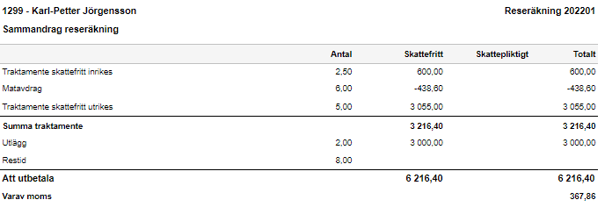

# Hur exporterar jag en reseräkningsspecifikation?

**Datum:** den 2 oktober 2025  
**Kategori:** Travel & Expense  
**Underkategori:** Reseräkningar  
**Typ:** howto  
**Svårighetsgrad:** intermediate  
**Tags:** bil  
**Bilder:** 3  
**URL:** https://knowledge.flexhrm.com/sv/reser%C3%A4kningsspecifikation-hur-exporterar-man-en-reser%C3%A4kningsspecifikation

---

För att skriva ut din reseräkningsspecifikation, använd knappen:

Utskriften öppnas i en ny flik, varifrån du sedan kan exportera den vidare eller skriva ut den på papper.

Totalsummor av alla delar visas alltid på sista sidan under ”Sammandrag reseräkning” eller före bilagor om du valt utskrift med bilagor.

