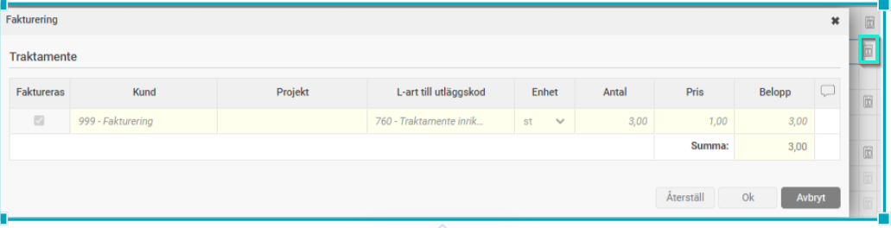
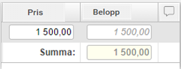
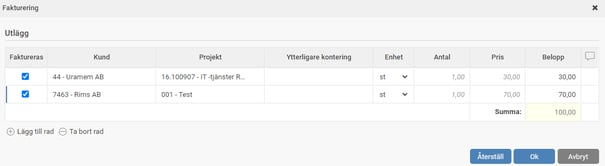
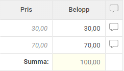

# Hur fakturerar jag en reseräkning?

**Datum:** den 2 oktober 2025  
**Kategori:** Travel & Expense  
**Underkategori:** Reseräkningar  
**Typ:** howto  
**Svårighetsgrad:** intermediate  
**Tags:** bil, utlägg  
**Bilder:** 5  
**URL:** https://knowledge.flexhrm.com/sv/fakturering-hur-fakturerar-man-en-reser%C3%A4kning

---

Utöver fakturering av en reseräkning beskriver artikeln även hur man kan fakturera olika delar av en reseräkningspost, samt förklarar externa kommentarer.
Fakturering
En reseräkning kan sättas som fakturerbar genom att du anger en kontering i huvudkonteringen som är fakturerbar; då kommer automatiskt varje delrad i reseräkningen att bli fakturerbar.
Du hittar faktureringsinformationen under följande ikon i registreringsbilden.

Om huvudkonteringen inte är fakturerbar och du har gjort en delkontering på en rad som i sig är fakturerbar sätts endast den raden som fakturerbar.
Om en kontering använts som standard inte är fakturerbar kan du ändå markera raden som fakturerbar (förutsatt att ingen kontering som används är satt till att aldrig kunna faktureras) genom att kryssa i Faktureras.
Alla delposter i faktureringsdialogen är editerbara för att göra det möjligt att ändra de värden som ska synas på fakturan. Exempelvis ska hela beloppet av ett utlägg kanske inte vidarefaktureras. Manuellt ändrade poster blir svarta, ärvda poster visas som grå-kursiv.

Fakturera olika delar av en reseräkningspost

Du kan dela upp en post att faktureras till olika kunder genom att lägga till en rad i faktureringsdialogen och själv välja kontering på den nya raden samt ange pris.
Extern kommentar
Till varje faktureringspost kan en extern kommentar anges

Denna kommentar syns sedan på faktureringsunderlaget.

Extern kommentar kan lämnas till varje faktureringspost, ej att blanda ihop med den interna kommentaren som är kopplad till den enskilda reseräkningsraden och bara syns i HRM Travel.
