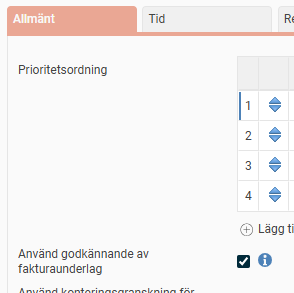
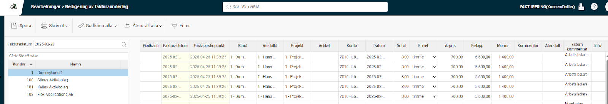

# ⚙️Hur fungerar funktionen "Redigering av fakturaunderlag"?

**Datum:** den 2 oktober 2025  
**Kategori:** Travel & Expense  
**Underkategori:** Inställningar  
**Typ:** config  
**Svårighetsgrad:** intermediate  
**Tags:** bil  
**Bilder:** 3  
**URL:** https://knowledge.flexhrm.com/sv/hur-fungerar-funktionen-redigering-av-fakturaunderlag-

---

Fakturaunderlag kan redigeras och godkännas i HRM innan det förs över till ditt ekonomisystem.
Redigering av fakturaunderlag
Fakturaunderlag kan redigeras och godkännas i HRM innan det förs över till ditt ekonomisystem.
Aktivera “Redigering av fakturaunderlag”
Under Administration – Allmänt – Roller ställer du in vilka roller som ska ha behörighet till vyn “Redigering av fakturaunderlag” som ligger under Bearbetningar.

Godkännande av fakturaunderlag
Aktivera “Godkännande av fakturaunderlag”
Under Administration – Inställningar – Allmänt – Fakturering kan du välja om du vill använda godkännande av fakturaunderlag. Det innebär att t.ex. en projektledare eller kundansvarig kan godkänna fakturaunderlagsraderna innan de exporteras till ekonomisystemet. Behörighet krävs till menyn “Redigering av fakturaunderlag”
Inställningar - Allmänt - Fakturering

“Redigering och godkännande av fakturaunderlag”
Vyn Redigering och godkännande av fakturaunderlag ser ut såhär:

Här visas alla de rader i fakturaunderlaget som blivit frisläppta per fakturadatum och kund. Du kan göra eventuella korrigeringar och godkänna raderna (om den funktionen används).
Kolumner som visas i vyn
Vilka kolumner som ska visas i redigeringsvyn och ordningen på dem ställer du in under Administration – Inställningar – Allmänt – Fakturering.
Återställ en redigering
Du kan även återställa alla rader till sitt ursprung om du vill.
Kommentar till redigeringen
Det finns också möjlighet att skriva en kommentar till din redigering.
Godkänna fakturarader
Det finns funktioner för att skriva ut fakturaunderlaget och godkänna alla. Om du ångrar dig med en redigering kan du återställa den raden till sitt ursprung.
Behörigheter för att godkänna
Där kan du också ställa in om du vill att behörigheterna ska gå enligt konteringsgranskning (ofta kallat delattest). Det innebär att en användare som t.ex. är behörig att delattestera Projekt A enbart kommer att få upp fakturarader på Projekt A. Annars används vanliga behörigheter till anställda. Om en användare har en roll som ger tillgång till redigeringsvyn på Avdelning 1 kommer alla fakturarader från anställda i Avdelning 1 att visas.
Info om vem som godkänt/redigerat en rad
Under kolumnen info visas information om vem som godkänt raden och när. Är raden redigerad kan du även där se de ursprungliga värdena.
Tips! Om du vill läsa mer om fakturering
Klicka här
