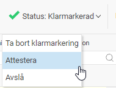
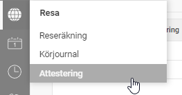
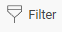
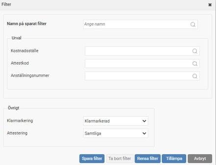
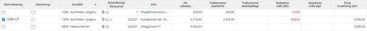
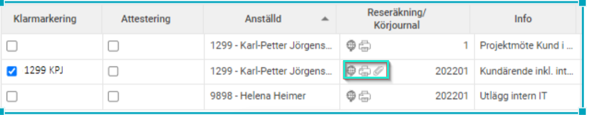
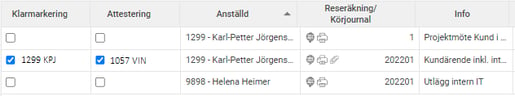
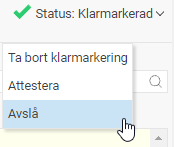
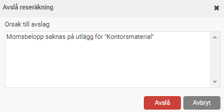
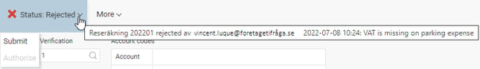

# Hur granskar och attesterar jag en reseräkning?

**Datum:** den 2 oktober 2025  
**Kategori:** Travel & Expense  
**Underkategori:** Reseräkningar  
**Typ:** howto  
**Svårighetsgrad:** intermediate  
**Tags:** attestering, bil  
**Bilder:** 11  
**URL:** https://knowledge.flexhrm.com/sv/attestering-av-reser%C3%A4kning-hur-genomf%C3%B6r-man-en-attestering-av-en-reser%C3%A4kning

---

En beskrivning för attestering av reseräkning, samt hur man avslår en reseräkning.
Attestering av reseräkning
Attestering av reseräkning kan göras direkt i registreringsvyn på reseräkningen, genom att hålla muspekaren över Status-knappen:

…eller via en översiktsvy över det som ska attesteras som finns under menyn Attestering:

I denna listas alla reseräkningar som matchar de kriterier som ställts in i filtreringsfunktionen:

Använd med fördel snabbknapparna för varje reseräkning för att (sett från vänster):

gå till reseräkningsvyn och öppna markerad reseräkning
skriva ut specifikationen
visa bilagorna och till vilken transaktion bilagan hör
Och för att slutligen attestera en reseräkning, klicka i Attesterings-rutan:

Avslå reseräkning
Med denna knapp kan du när du håller muspekaren över Status-knappen avslå aktuell reseräkning direkt på reseräkningen.

När man avslår reseräkningen måste man ange en orsak.

Meddelandet syns på reseräkningen, och den anställde kan få notis om detta via påminnelser.

