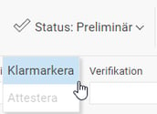

# Hur granskar och klarmarkerar jag en reseräkning?

**Datum:** den 14 november 2025  
**Kategori:** Travel & Expense  
**Underkategori:** Reseräkningar  
**Typ:** howto  
**Svårighetsgrad:** beginner  
**Tags:** bil  
**Bilder:** 1  
**URL:** https://knowledge.flexhrm.com/sv/granska-reser%C3%A4kning-hur-granskar-och-klarmarkerar-man-en-reser%C3%A4kning

---

Hur granskar och klarmarkerar jag en reseräkning så att den kan gå vidare till attest?
När din reseräkning är helt klar och du vill låta den gå vidare för attest håller du muspekaren över ”Status: Preliminär”, och på ”Klarmarkera ” för att sätta din signatur på att reseräkningen är färdig och korrekt.

Klarmarkering sätts då, och status på reseräkningen ändras. Du är nu klar att påbörja nästa reseräkning.
