# Hur importerar jag en körjournal från Volvo cars-appen till HRM Travel?

**Datum:** den 2 oktober 2025  
**Kategori:** Travel & Expense  
**Underkategori:** Reseräkningar  
**Typ:** howto  
**Svårighetsgrad:** intermediate  
**Tags:** bil, resa  
**Bilder:** 21  
**URL:** https://knowledge.flexhrm.com/sv/hur-importerar-jag-en-k%C3%B6rjournal-fr%C3%A5n-volvo-cars-appen-till-hrm-travel

---

I HRM Travel kan man importera körjournaler från Volvo cars-appen. Artikeln beskriver dels hur man skapar en csv-fil i appen samt hur man importerar filen till en reseräkning i HRM Travel.
Inställningar i Volvo cars-appen
Skapa csv från appen Volvo cars
Innan jag skapar csv-filen bör jag först kategorisera mina resor i appen som antingen arbetsresor eller privatresor. Detta för att enkelt välja enbart arbetsresor när jag väl ska skapa och skicka csv-filen
Kategorisera resorna som “Arbete”
Valfria alternativ är att välja att sammanfoga resor under samma datum till 1 resa, alternativt sammanfoga alla månadens resor till 1 resa. Om jag inte sammanfogar så bibehålls alla resor var för sig.

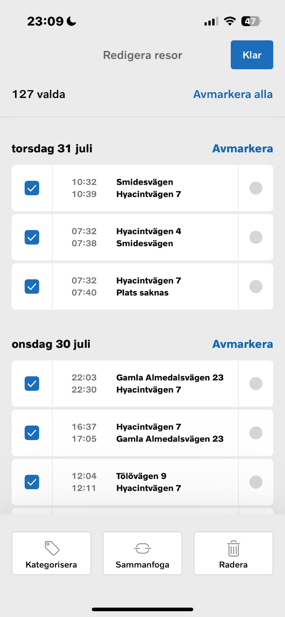
När jag är redo att skapa en csv-fil med periodens resor så öppnar jag appen och väljer alternativet Körjournal och därefter alternativet Exportera.
Klicka på Körjournal Välj Exportera
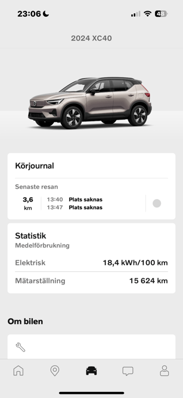
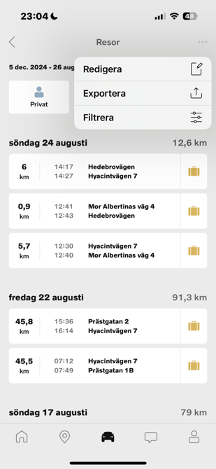
Markera “Arbete” och  ange vilka datum som ska exporteras samt markera CSV. Klicka på Exportera
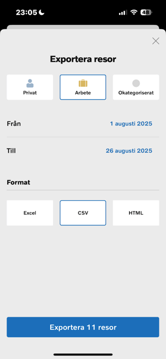
Välj Mail och skicka filen till din epostadress
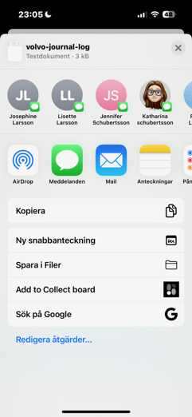
Import av bilresor i Flex HRM Travel
Importera bilresor
Öppna Flex HRM Travel - Reseräkning
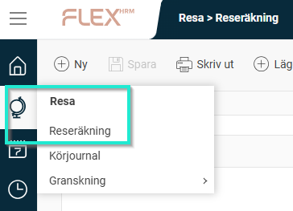
Skapa en ny reseräkning. Välj alternativet ”Importerade bilresor”  under menyingången “Mer”

Klicka på Filimport
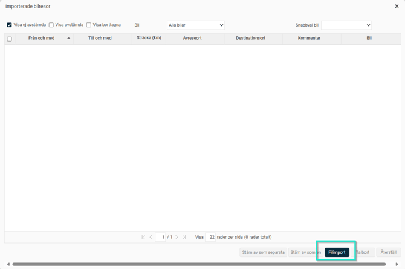
Välj importmallen “Volvo cars” och sedan “välj fil”. Välj den nedsparade filen från appen Volvo cars och klicka på “importera”.

Välj min bil under ”Snabbval bil”
Välj sedan om jag vill hantera en varje resa för sig (Stäm av som separata), eller om jag vill slå ihop flera (Stäm av som en).
Om jag redan sammanfogad mina arbetsresor i Volvo cars-appen så välj alternativet “stäm av som separata”.
Om jag inte sammanfogat resorna i appen så får kan jag välja att göra det i detta skede och markera de resor jag vill “stämma av som en”.
Klicka på något av alternativen “Stäm av som separata” eller “Stäm av som en”

Min resa/resor läggs ut i reseräkningen.

Vid behov kan jag redigera resorna och lägga till exempelvis ärende, företag eller kontaktperson.

Ta bort inlästa transaktioner
Har jag läst in bilresor som jag inte ska rapportera eller ha ersättning för så kan jag välja att ta bort dem från listan.
Markera resorna som ska tas bort och klick på knappen “Ta bort”

Se/hämta borttagna bilresor
Vill jag se vilka resor som har tagits bort kan jag bocka i “Visa borttagna”. Här kan jag även hämta tillbaka borttagna resor.
Klicka i Visa borttagna
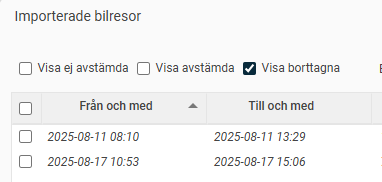
Markera de resor jag vill hämta tillbaka och klicka på “Återställ”

Rapport - Körjournal
Om behovet finns att skriva ut en körjournal så går jag till Resa - Körjournal
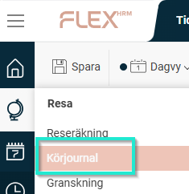
Klicka på ikonen “Skriv ut”
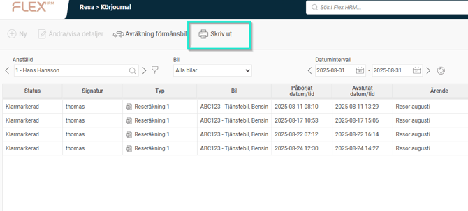
Välj
fr.om
och t.o.m datum. Klicka OK
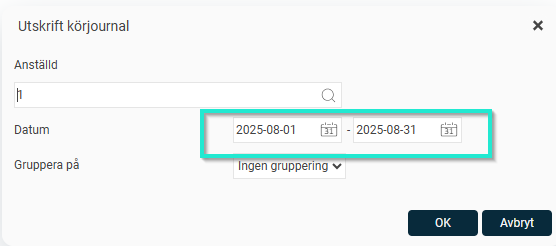
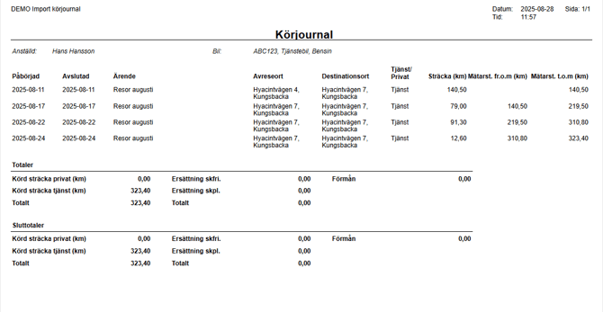
Du kan ladda ner rapporten som PDF eller skriva ut direkt till skrivare.
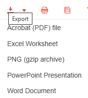
Tips! Om du vill läsa om hur man sätter upp en importmall i HRM Travel så Klicka här
