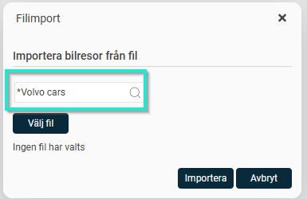
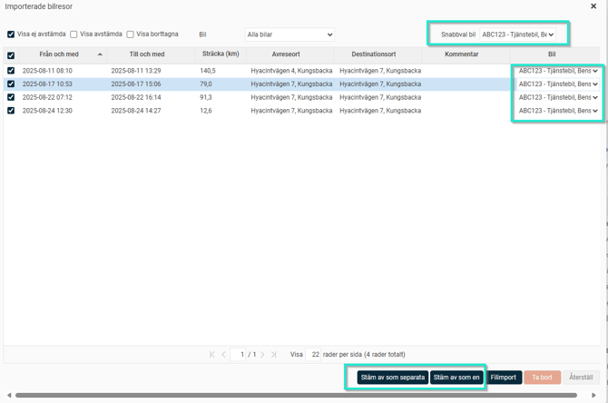
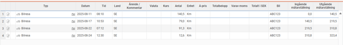
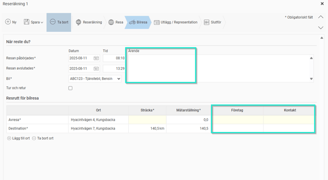
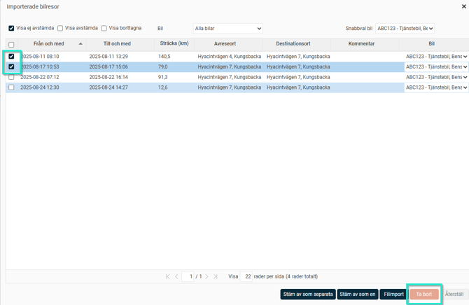
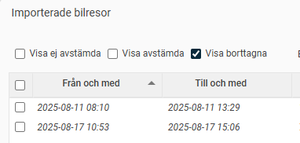
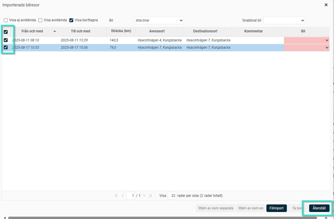

# Hur importerar jag en körjournal till en reseräkning i HRM Travel?

**Datum:** den 2 oktober 2025  
**Kategori:** Travel & Expense  
**Underkategori:** Reseräkningar  
**Typ:** howto  
**Svårighetsgrad:** intermediate  
**Tags:** bil, resa  
**Bilder:** 9  
**URL:** https://knowledge.flexhrm.com/sv/hur-importerar-jag-en-k%C3%B6rjournal-till-en-reser%C3%A4kning-i-hrm-travel

---

Antingen har jag själv laddad ner en körjournal som jag vill importera alternativt har en administratör importerat körjournalen och jag behöver stämma av den importerade körjournalsfilen.
Importera bilresor till en reseräkning
Följ dessa steg för att importera bilresor från en fil till din reseräkning:
Klicka på
Mer
och sedan
Importerade bilresor
.

Fönstret som öppnas visar de bilresor som inte är avstämda.
För att importera nya bilresor, klicka på knappen
Filimport
.

Välj den import du vill använda och klicka på
Välj fil
för att ladda upp filen du vill importera.

Klicka på
Importera
.
När importen är klar visas de nya bilresorna i fönstret. Om registreringsnummer inte finns med i filen väljer du vilken bil resorna är gjorda med. Du kan också använda
Snabbval bil
för att välja en bil för alla resor samtidigt. Välj sedan vilka bilresor du vill stämma av på reseräkningen.
Du kan välja att stämma av alla valda resor som separata bilresor, eller som en enda bilresa på reseräkningen. Om du stämmer av dem som en resa kommer alla destinationsorter att läggas till som orter på resrutten och sträckan att summeras.

När avstämningen är klar visas de nya bilresorna i din reseräkning.

Vid behov kan jag redigera resorna och lägga till exempelvis ärende, företag eller kontaktperson.

Ta bort inlästa transaktioner
Har jag läst in bilresor som jag inte ska rapportera eller ha ersättning för så kan jag välja att ta bort dem från listan.
Markera resorna som ska tas bort och klick på knappen “Ta bort”

Se/hämta borttagna bilresor
Vill jag se vilka resor som har tagits bort kan jag bocka i “Visa borttagna”. Här kan jag även hämta tillbaka borttagna resor.
Klicka i Visa borttagna

Markera de resor jag vill hämta tillbaka och klicka på “Återställ”

Tips! Vill du läsa om hur man sätter upp en importmall för import av körjournaler?
Klicka här
