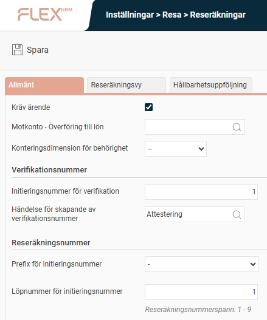
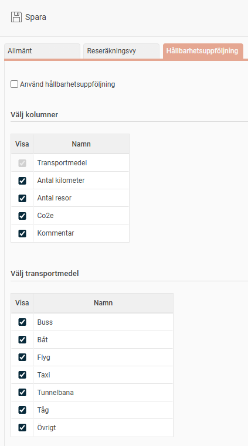
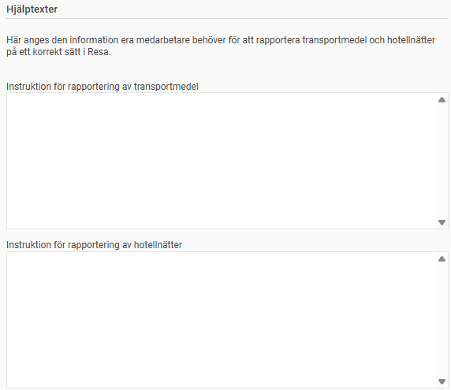

# ⚙️Hur konfigurerar vi generella inställningar för reseräkningar i HRM Travel?

**Datum:** den 2 oktober 2025  
**Kategori:** Travel & Expense  
**Underkategori:** Inställningar  
**Typ:** config  
**Svårighetsgrad:** intermediate  
**Tags:** bil  
**Bilder:** 4  
**URL:** https://knowledge.flexhrm.com/sv/hrm-travel-hur-konfigurerar-man-generella-inst%C3%A4llningar-f%C3%B6r-reser%C3%A4kningar-i-hrm-travel

---

HRM Travel - "Reseräkningar
"
I denna vy ställer man in generella data för reseräkningen:
kräv ärende
motkonto - överföring till lön
konteringsdimension för behörighet
initieringsnummer för verifikation
initieringsnummer för reseräkningar
händelse för skapande av verifikationsnummer
prefix för initieringsnummer
löpnummer för initieringsnummer

I fliken
Reseräkningsvy
kan du ställa in inställningar för layout, summering och transaktionstyper.

I fliken
Hållvarhetsuppföljning
kan du ställa in inställningar för hållbarhetsuppföljning.

Du kan även skriva instruktioner för rapportering av transportmedel och hotelnätter.

