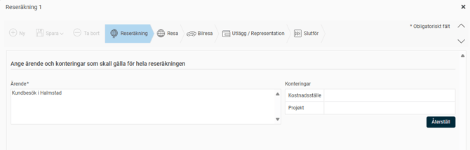
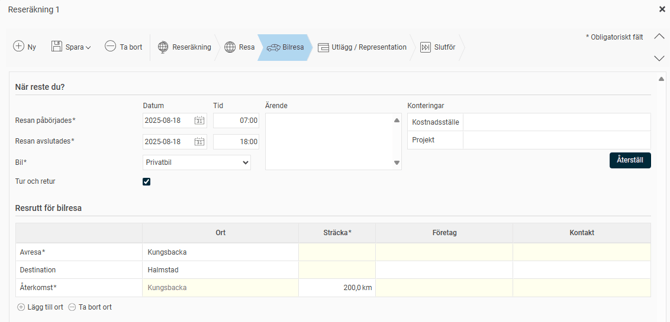
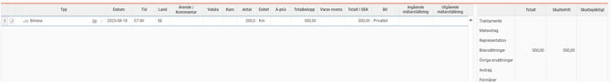

# Hur rapporterar jag bilresor i HRM Travel?

**Datum:** den 2 oktober 2025  
**Kategori:** Travel & Expense  
**Underkategori:** Reseräkningar  
**Typ:** howto  
**Svårighetsgrad:** intermediate  
**Tags:** bil, resa  
**Bilder:** 4  
**URL:** https://knowledge.flexhrm.com/sv/hur-rapporterar-jag-bilresresor-i-hrm-travel

---

Hur rapporterar jag bilresor i HRM Travel och ser att jag fått korrekta ersättningar?
Rapportera bilresor
Du rapporterar dina resor genom att gå till menyn
Resa > Reseräkning
.
Skapa en ny reseräkning
Börja med att fylla i ärendet för resan och klicka sedan på
Spara
. Därefter går du vidare till fliken
Bilresa
.

Börja med att fylla i ärendet för resan och klicka sedan på
Spara
. Därefter går du vidare till fliken
Bilresa
.

Fyll i datum för resan, avrese- och destinationsort, vilket fordon du använde samt hur lång sträckan var. Om du har besökt flera orter längs vägen, kan du fylla i din
Resrutt
.
Vissa företag kräver att du också anger ärende för bilresan. Det kan även vara obligatoriskt att ange konteringar, som till exempel kostnadsställe eller projekt.

Klicka på
Spara
och stäng registreringen. För att se vilka belopp som betalas ut kan du välja att
Visa summor
.

