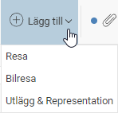
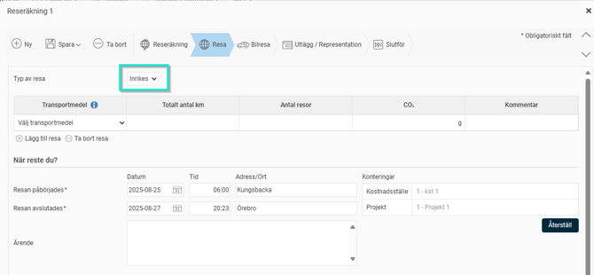
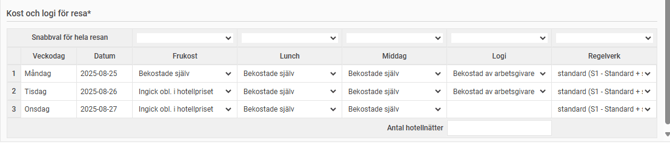
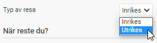
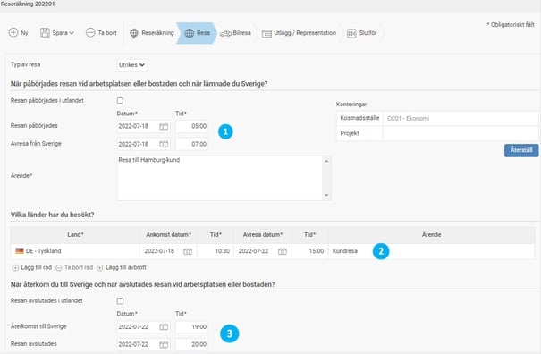

# Hur rapporterar jag traktamentsresor i HRM Travel?

**Datum:** den 2 oktober 2025  
**Kategori:** Travel & Expense  
**Underkategori:** Reseräkningar  
**Typ:** howto  
**Svårighetsgrad:** advanced  
**Tags:** bil, resa, traktamente  
**Bilder:** 6  
**URL:** https://knowledge.flexhrm.com/sv/rapportera-resetransaktioner-hur-rapporterar-man-resetransaktioner-i-hrm-travel

---

Hur rapporterar jag inrikes-och utrikes traktamentesresor i HRM Travel?
Rapportera resetransaktioner
För att rapportera dina resetransaktioner använder du först menyn
Resa
och sedan
Reseräkning
.

Systemet guidar dig steg för steg genom registreringen. Kom ihåg att spara varje transaktion när du är klar.
Inrikes resa

När du klickar på
Lägg till
och väljer
Resa
möts du av en dialogruta. Välj
Inrikes resa
.

Börja med att fylla i resans längd och ange ett ärende. Beroende på inställningarna i systemet kan du också behöva ange besökt adress eller ort. Här fyller du även i eventuella konteringar.
Varje transaktion kan delkonteras. Det betyder att du kan ge en transaktion en annan kontering än reseräkningens huvudkontering. Konteringar som är ärvda från huvudkonteringen visas i grå kursiv stil. Om du ändrar en kontering blir texten svart.
Under
Kost & Logi
anger du hur varje måltid har bekostats. Om det föreslagna alternativet inte stämmer för någon dag, kan du redigera detta i respektive dropplista.

Om alla föreslagna måltider är felaktiga för hela resan, kan du använda snabbvalet högst upp för att ändra hela kolumnen på en gång. I kolumnen
Logi
anger du hur eventuell övernattning har bekostats.
Den sista kolumnen används bara om du behöver ändra traktamentesregler för att systemet ska kunna räkna ut ersättningen korrekt.
Utrikes resa
När du väljer
Resa
kan du även registrera en
Utrikes
resa.

En utrikes resa har tre delar när det gäller resans längd:
hur resan ser ut när den startar i Sverige
hur länge du är i ett annat land
hur resan ser ut när du kommer hem till Sverige igen
Vi börjar med
Avresan
. Ange resans start och när du lämnade Sverige.
Därefter anger du vilka länder du har besökt och hur länge du stannade i varje land. Om du har besökt flera länder under samma resa kan du lägga till fler med
Lägg till under sista raden
.

OBS!
Tänk på att alltid ange alla klockslag i lokal tid. Det är nödvändigt för att systemet ska kunna göra en korrekt traktamentsberäkning.
