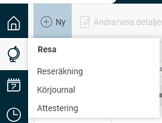
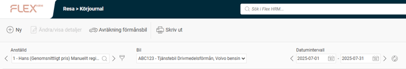
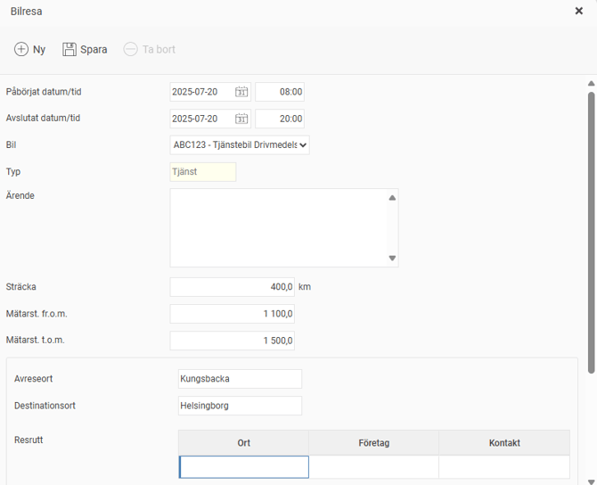

# Hur registrerar jag bilresor med drivmedelsförmån i körjournalen samt anger utgående mätarställning i månadens slut?

**Datum:** den 2 oktober 2025  
**Kategori:** Travel & Expense  
**Underkategori:** Reseräkningar  
**Typ:** howto  
**Svårighetsgrad:** intermediate  
**Tags:** bil, resa  
**Bilder:** 5  
**URL:** https://knowledge.flexhrm.com/sv/hur-registrerar-jag-resor-med-f%C3%B6rm%C3%A5nsbil-i-k%C3%B6rjournalen

---

Vid drivmedelsförmånsbilar måste du registrera dina tjänsteresor samt ange utgående mätarställning vid månadens slut för att kunna beräkna vilken drivmedelsförmån du haft under månaden för de privat körda milen.
Gå till Körjournal
När du ska registrera en ny körjournal i HRM Travel börjar du med att välja rätt bil och tidsperiod.
Gå till
Körjournal
.

Välj rätt
bil
och
datumintervall
.

Klicka på knappen
Ny
för att starta registreringen av en ny bilresa.

Fyll i de efterfrågade uppgifterna och klicka på
Spara
.
När alla bilresor för månaden har rapporterats så ska du
Avräkna förmånsbil
och ange utgående mätarställning per den siste i aktuell månad.

Glöm inte att Klarmarkera Avräkningen!

