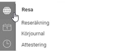
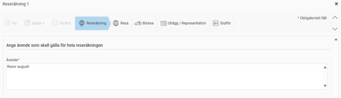
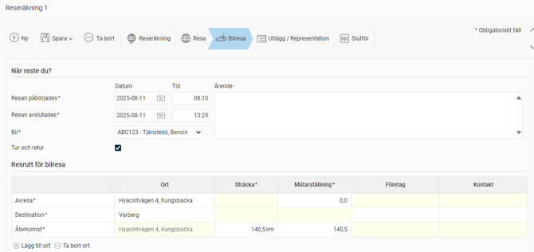
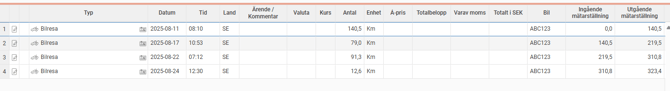
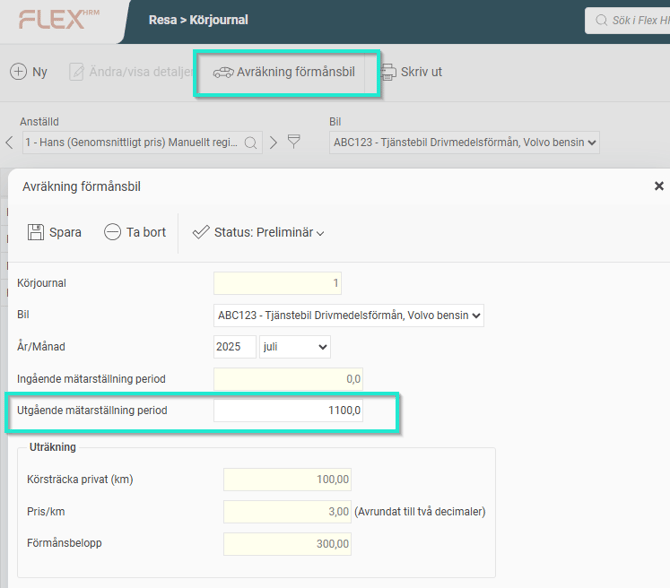
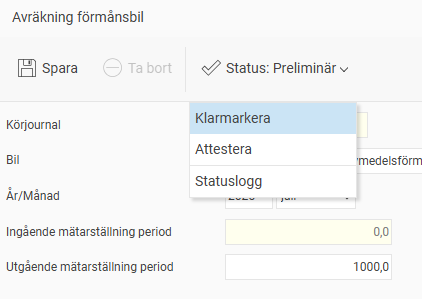

# Hur registrerar jag bilresor med drivmedelsförmån i reseräkningsvyn samt anger utgående mätarställning i månadens slut?

**Datum:** den 5 december 2025  
**Kategori:** Travel & Expense  
**Underkategori:** Reseräkningar  
**Typ:** howto  
**Svårighetsgrad:** intermediate  
**Tags:** bil, resa  
**Bilder:** 7  
**URL:** https://knowledge.flexhrm.com/sv/hur-registrerar-jag-resor-med-f%C3%B6rm%C3%A5nsbilar-med-drivmedelsf%C3%B6rm%C3%A5n-i-reser%C3%A4kningsvyn

---

Vid drivmedelsförmånsbilar måste du registrera dina tjänsteresor samt ange utgående mätarställning vid månadens slut för att kunna beräkna vilken drivmedelsförmån du haft under månaden för de privat körda milen.
Rapportera bilresor
Du rapporterar dina resor genom att gå till menyn
Resa > Reseräkning
.
Gå till Reseräkning.

Börja med att fylla i ärendet för resan och klicka sedan på
Spara
. Därefter går du vidare till fliken
Bilresa
.

Fyll i datum för resan, avrese- och destinationsort, vilket fordon du använde samt hur lång sträckan var. Om du har besökt flera orter längs vägen, kan du fylla i din
Resrutt
.

När alla bilresor för månaden har rapporterats så ska du
Avräkna förmånsbil
och ange utgående mätarställning per den siste i aktuell månad.

Gå till
Körjournal

Välj
Avräkning förmånsbil
och ange utgående mätarställning.

Glöm inte att
Klarmarkera
avräkningen.

