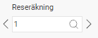
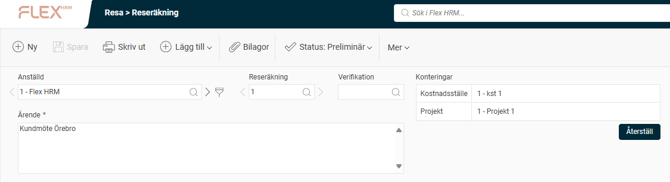
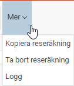
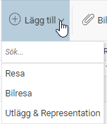
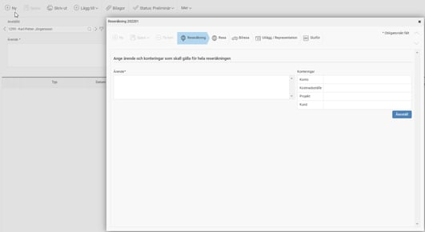
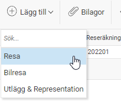
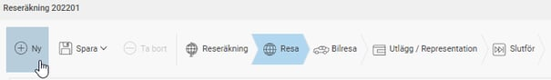
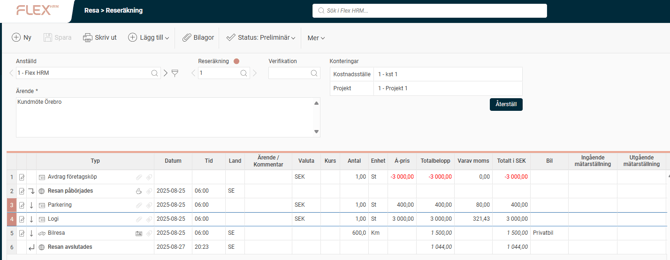
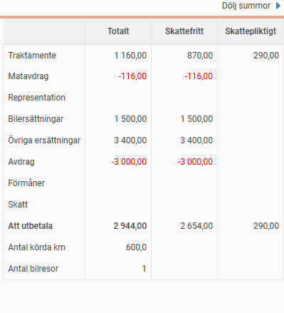
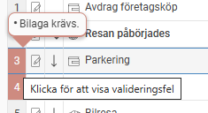

# Hur registrerar jag en reseräkning i HRM Travel?

**Datum:** den 2 oktober 2025  
**Kategori:** Travel & Expense  
**Underkategori:** Reseräkningar  
**Typ:** howto  
**Svårighetsgrad:** intermediate  
**Tags:** bil, resa, traktamente, utlägg  
**Bilder:** 11  
**URL:** https://knowledge.flexhrm.com/sv/reser%C3%A4kning-hur-skapar-jag-en-reser%C3%A4kning

---

Hur registrerar jag en reseräkning i HRM Travel för gjorda utlägg, traktamentesnätter samt bilresor.
Översikt reseräkning
Reseräkningens huvudinformation visas alltid högst upp i reseräkningsvyn. Dina reseräkningar finns alltid samlade under Reseräknings-listan.

Reseräkningen Ärende är en beskrivning av vad just denna reseräkning innehåller.
Konteringar är det som benämns som huvudkontering och gäller för alla delar i reseräkningen om ingen delkontering gjorts på enskilda rader.

Längst ut till höger – under ”Mer” – har du möjlighet att kopiera befintlig reseräkning, ta bort reseräkningen, samt se vad som loggats på reseräkningen ifråga.

Alla delar av en reseräkning registreras med hjälp av de tre funktionsknapparna:

Registrering kan även göras direkt via funktionsknappen NY i transaktionsvyn.

För att lägga till transaktioner på reseräkningen, klicka på ”Lägg till”

Samma funktionalitet finns direkt i transaktionsvyn. Detta underlättar då man vill registrera flera transaktioner som är av olika typ, du kan nu göra det direkt utan att behöva stänga ner popupen.

För att ytterligare underlätta registreringen kommer –  om du först registrerar en resa och sedan väljer att skapa en ny bilresa eller ett utlägg –  datum och tid från resan att kopieras med till bilresan eller utlägget. På så sätt kan du registrera allting som tillhör samma resa utan att behöva fylla i datum eller tid flera gånger.
Allteftersom du rapporterar olika poster kommer sammanställningen av reseräkningen att fyllas på:

För att se totalsummor för reseräkningen, klicka på Visa summor längst ut till höger.

Valideringsfel i sammanställningen
Om något saknas, är inkorrekt ifyllt eller fel på något annat vis som gör att granskning inte kommer att kunna göras kommer det att synas som en röd markering i sammanställningen.
Genom att klicka på den röda markeringen får du information om vad som kan vara fel. Åtgärda och spara så ska cellen bli grå och ok.

