# Hur registrerar jag reseräkningar i HRM Mobile?

**Datum:** den 5 december 2025  
**Kategori:** Travel & Expense  
**Underkategori:** Utlägg & Kvitton  
**Typ:** howto  
**Svårighetsgrad:** intermediate  
**Tags:** bil, kvitto, mobil, resa, utlägg  
**Bilder:** 17  
**URL:** https://knowledge.flexhrm.com/sv/hur-registrerar-jag-reser%C3%A4kningar-i-mobilen

---

I HRM Mobile kan du enkelt fotografera kvitton, registrera körda mil, hantera utlägg och signera din reseräkning, oavsett var du befinner dig.
Skapa och hantera reseräkningar i HRM Mobile
I HRM Mobile kan du hantera hela din reseräkning direkt i mobilen. Du kan fotografera kvitton och koppla dem till dina utlägg, se dina körda mil och sköta avräkningen för din tjänstebil.
Arbeta med reseräkningar
När du öppnar funktionen för reseräkningar visas den senaste du har arbetat med. Om du vill hantera en annan reseräkning kan du bläddra till en tidigare eller skapa en ny.
Du kan också använda menyknappen

uppe till höger för att:
Skapa ny reseräkning
Välja en befintlig reseräkning
Ta bort reseräkning
(endast preliminära)
Skriva ut reseräkning med bilagor
Registrera en huvudkontering
Summor och saldon
Granskning av reseräkning
Lägg till transaktioner
Börja med att ange vad reseräkningen gäller genom att fylla i
Ärende
.
Om du vill kontera hela reseräkningen, exempelvis med ett specifikt projekt, kan du göra det under menyknappen och sedan
Konteringar
. Konteringen du anger här gäller för alla transaktioner i reseräkningen, om du inte anger en annan kontering på en enskild transaktion.
Därefter är det dags att lägga till transaktioner i reseräkningen. Klicka på

och välj en av transaktionstyperna.
En transaktionsrad blir grön när allt är korrekt ifyllt. Om något saknas eller är felaktigt blir raden röd. För att se vad som behöver korrigeras, öppna transaktionen, använd menyknappen och välj
Kontrollera inmatning
.
Typer av transaktioner
Här beskriver vi hur du registrerar de olika typerna av transaktioner.
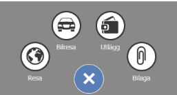
Resa
Börja med att ange typ av resa och fyll i datum, tid, ärende och eventuell kontering.
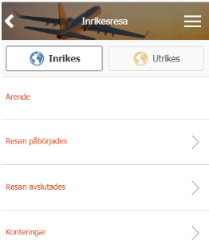
För en utlandsresa måste du ange datum och tid för avresa hemifrån och från Sverige. Därefter ska du ange vilka länder du besökt. Tänk på att alltid ange tider i lokal tid.
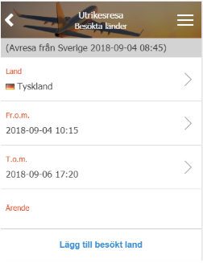
Detta hjälper systemet att beräkna i vilket land du har befunnit dig längst tid. En utlandsresa avslutas med att du återvänder till Sverige.
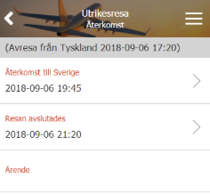
Därefter ska du fylla i information om kost och logi
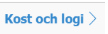
. För varje dag kan du ange hur frukost, lunch och middag har bekostats. Om det är samma för alla dagar kan du använda snabbvalet längst upp. Här anger du också hur logi har bekostats.
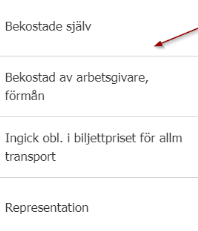
Bilresa
För bilresor anger du först om det är en enkel resa eller en tur och retur-resa. Fyll sedan i ärende, datum, tid och orter.
Du anger avreseort och destinationsort, och kan lägga till ytterligare orter om resan inte går direkt mellan två platser.
Till sist anger du resans totala sträcka.
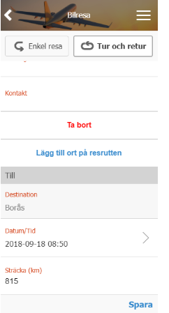
Utlägg
Börja med att ange typ av utlägg. Detta styr vilka fält som behöver fyllas i. Du kan antingen bläddra i listan eller söka för att hitta rätt utläggstyp.
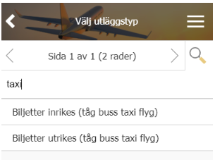
Fyll i information som datum, belopp, moms, kommentar och kontering. Om du inte ändrar datumet sätts det automatiskt till dagens datum. Om du redigerar ett befintligt utlägg kan du ta bort det om det är felaktigt.
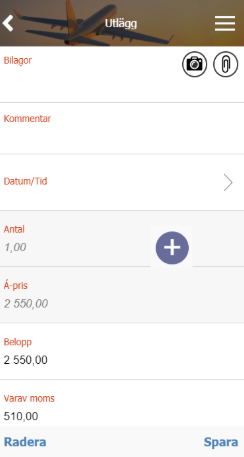
Bilagor
Använd bilagefunktionen för att ta ett kort på ditt kvitto och direkt koppla det till ditt utlägg.
Klicka på

för att antingen:
Fota kvittot.
Använda en bild du tagit sedan tidigare.
Hämta en fil från en kopplad molntjänst.
Så snart din bilaga är skapad är den kopplad till ditt utlägg. Om du klickar på bilagan
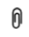
kan du se en förhandsgranskning och ändra bilagans beskrivning.
Behöver du ändra namnet på bilagan, ta bort kopplingen till utlägget eller helt radera den, klickar du på bilden eller på:
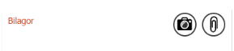
Representation
Representation hanteras som ett utlägg, men kräver annan information. Du registrerar den på samma sätt som ett vanligt utlägg.
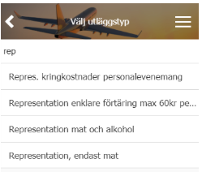
Börja med att välja typ, antingen genom att söka eller bläddra i listan. Fyll därefter i nödvändig information, som antal deltagare, belopp, moms, dricks, syfte och deltagarnas namn.
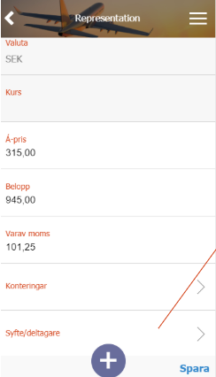
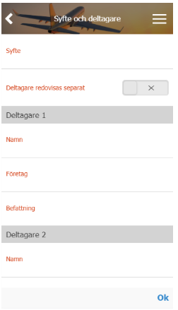
Slutför reseräkningen
Du kan kontrollera en summering av reseräkningen under menyknappen och sedan
Summering
.
För att slutföra reseräkningen behöver du signera den. Du gör detta genom att använda menyknappen och sedan
Klarmarkera
. Om allt är korrekt ifyllt kommer reseräkningen att få statusen klarmarkerad. Om något saknas kommer systemet att visa vad du behöver justera.
