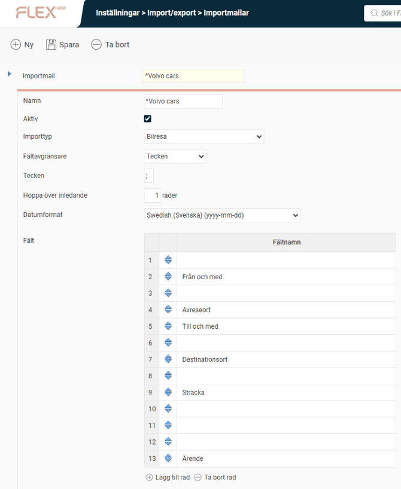
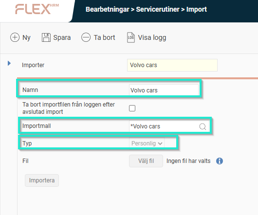

# ⚙️Hur sätter jag upp en importmall av körjournal för filer från Volvo cars-appen?

**Datum:** den 1 oktober 2025  
**Kategori:** Travel & Expense  
**Underkategori:** Inställningar  
**Typ:** config  
**Svårighetsgrad:** intermediate  
**Tags:** bil  
**Bilder:** 2  
**URL:** https://knowledge.flexhrm.com/sv/hur-s%C3%A4tter-jag-upp-en-importmall-av-k%C3%B6rjopurnal-efr%C3%A5n-volvo-cars-appen

---

Artikeln beskriver hur jag sätter upp en importmall i HRM Travel som är anpassad för att kunna importera körjournaler från Volvo cars via en csv-fil.
Ställ in en importmall för Volvo cars
Den här artikeln beskriver hur du ställer in en importmall för körjournaler från Volvo cars.
Skapa importmallen
Börja med att skapa en importmall som matchar utseendet på CSV-filen från appen i Volvo cars.
Gå till
Inställningar > Import/export > Importmallar
.
Skapa en ny mall och döp den till
Volvo cars
.

Skapa bearbetningsjobb för import
För att dina medarbetare ska kunna importera filerna måste du ställa in ett bearbetningsjobb.
Gå till
Bearbetningar > Servicerutiner > Import
.
Fyll i följande fält:
Namn: Volvo cars
(Detta är namnet som visas när medarbetare ska importera sin fil.)
Importmall
: Volvo cars
Typ
: Personlig

Tips! Vill du veta hur du exporterar körjournalen från Volvo cars?
Klicka här
