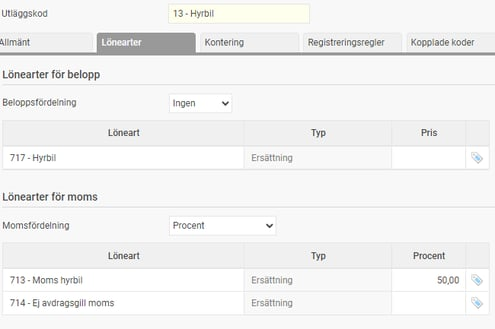

# ⚙️Hur sätter vi upp en utläggskod för hyrbilar där vi har rätt att dra av 50% av momsbeloppet?

**Datum:** den 2 oktober 2025  
**Kategori:** Travel & Expense  
**Underkategori:** Utlägg & Kvitton  
**Typ:** config  
**Svårighetsgrad:** intermediate  
**Tags:** bil, utlägg  
**Bilder:** 1  
**URL:** https://knowledge.flexhrm.com/sv/hur-s%C3%A4tter-man-upp-en-utl%C3%A4ggskod-f%C3%B6r-hyrbilar-d%C3%A4r-man-har-r%C3%A4tt-att-dra-av-50-av-momsbeloppet

---

Info Hyrbil
Har du hyrt bilen får du vanligtvis dra av 50 procent av momsbeloppet. En förutsättning för avdrag vid hyra av personbil är att bilen körs minst 100 mil per år i en verksamhet som du ska betala moms för eller som gör att du har rätt till återbetalning.
Lägg upp en ny löneart för ersättning hyrbil samt en ny löneart för moms för att kunna följa upp just hyrbilar

