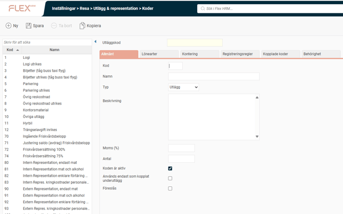
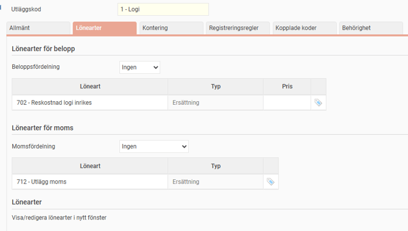
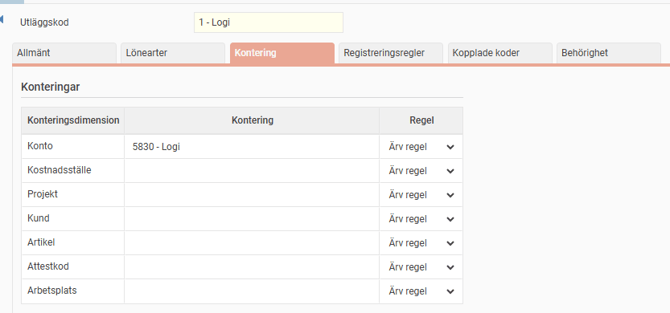
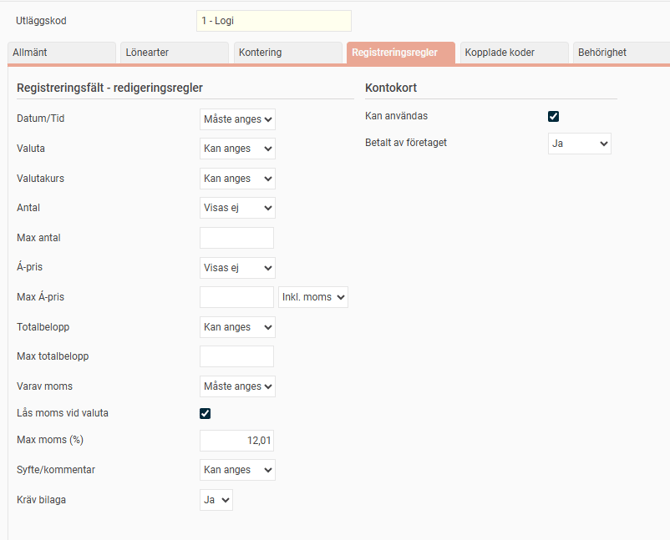
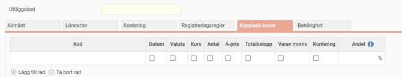
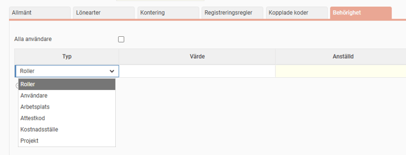

# ⚙️Utlägg och representation - Var redigerar man de olika inställningarna för utlägg och representation?

**Datum:** den 23 december 2025  
**Kategori:** Travel & Expense  
**Underkategori:** Utlägg & Kvitton  
**Typ:** config  
**Svårighetsgrad:** intermediate  
**Tags:** bil, utlägg  
**Bilder:** 6  
**URL:** https://knowledge.flexhrm.com/sv/utl%C3%A4gg-och-representation-var-redigerar-man-de-olikainst%C3%A4llningarna-f%C3%B6r-utl%C3%A4gg-och-representation

---

Under "Utlägg & representation" ställer man in koder för olika utlägg. Här definierar man allmänna uppgifter som namn och momssats, kopplar lönearter och konton för bokföring, samt specificerar registreringsregler som krav på bilaga och maxbelopp.
Utlägg och representation - "Koder"
Fliken
Allmänt
Här anger du kod, namn, typ, moms, antal samt bockar i koden är aktiv, används endast som kopplat underutlägg, föreslås.

Fliken
Lönearter
Här anger du lönearter och lönearter för moms kopplade till detta utlägg.

Fliken
Kontering
Här anger du konteringar kopplade till detta utlägg, t.ex. konto, kostnadsställe, projekt, kund, artikel, attestkod. Du har även möjlighet att välja regel för konteringsdimensioner.

Fliken
Registreringsregler
Här anger du regler vid registrering av vald utläggskod:
datum/tid
valuta, valutakurs
antal
max antal
a-pris
max a-pris
totalbelopp
vara moms
max moms (%)
syfte/kommentar
kräv bilaga
kontokort
kan användas
betald av företaget

Fliken Kopplade koder
Här kan man vid behov koppla på att en annan kod ska falla ut med automatik när denna kod används.

Fliken
Behörighet
Här anger du styra behörigheten till koden till endast vissa Roller eller Användare o.s.v
Defaultvärdet är "Alla användare" aktiverat

