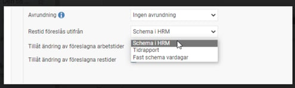
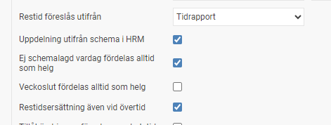

# ⚙️Vad betyder de olika alternativen i inställningarna i Restid?

**Datum:** den 2 oktober 2025  
**Kategori:** Travel & Expense  
**Underkategori:** Inställningar  
**Typ:** concept  
**Svårighetsgrad:** beginner  
**Tags:** bil  
**Bilder:** 2  
**URL:** https://knowledge.flexhrm.com/sv/restid-vad-betyder-de-olika-alternativen-i-inst%C3%A4llningarna-i-restid

---

Info Restid
Vad är skillnaden på “Schema i HRM” och “Tidrapport”?

Schema i HRM
- betyder att oavsett hur jag registrerat arbetstid i min tidrapport så föreslås mina planerade arbetstider.
Exempelvis om jag är schemalagd 8-17 och har registrerat arbetstid 7.30 - 17.05 så utgår min restid ändå från 8-17.
Tidrapport
- betyder att systemet utgår från de faktiskt registrerade arbetstiderna i tidrapporten.
Exempelvis om jag är schemalagd 8-17 men har registrerat arbetstid 7.30 - 17.05 så utgår min restid från 7.30-17.05 istället för 8-17
Vad betyder “Uppdelning utifrån schema i HRM”?

Uppdelningen mellan löneart för arbetsdag och löneart för ledig dag görs enligt schema i HRM Time. Detta är användbart om en anställd tillfälligt arbetar på en ledig dag och då ska få restidsersättning för restid på ledig dag.
Vad betyder “Ej schemalagd vardag fördelas alltid som helg”
Det innebär att om jag registrerar restid på en ledig ej schemalagd vardag så får jag ändå helgersättning.
Vad betyder “Veckoslut fördelas alltid som helg ibockad”
Det  innebär att om jag är schemalagd att arbeta en lördag eller söndag så får jag helgersättning ändå. Är den urbockad får jag vardagsersättning på lördag och söndag.
Vad betyder “Restidsersättning även vid övertid”?
Om man aktiverar detta alternativ betyder det att man får restidsersättning även för den arbetstid man arbetar övertid.
Exempelvis om jag arbetar övertid en lördag mellan 8-9 och registrerar restid mellan 7-10 så får jag restidsersättning för 3 timmar.
Är den ej aktiverad får man endast 2 timmar.
Observera att detta gäller endast om tidkoden är av typen Närvaro -Övertid, Mertid, Komp in. Det fungerar alltså inte om man har tidkoden ARB.
