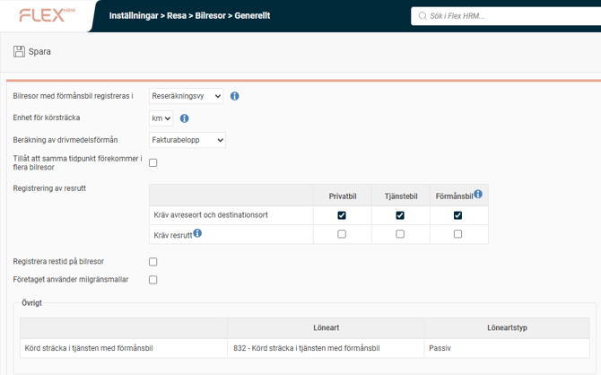
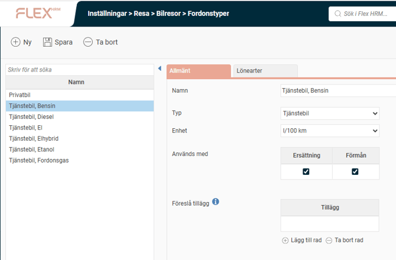
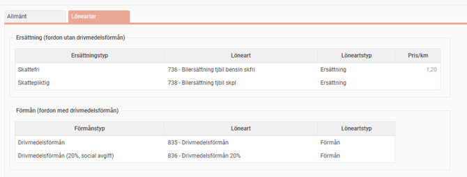

# ⚙️Var och hur hanterar vi inställningarna för bilresor?

**Datum:** den 5 december 2025  
**Kategori:** Travel & Expense  
**Underkategori:** Bilresor  
**Typ:** config  
**Svårighetsgrad:** advanced  
**Tags:** bil  
**Bilder:** 3  
**URL:** https://knowledge.flexhrm.com/sv/bilresor-

---

Under Bilresor i administrationen kan du ställa in generella inställningar som enhet för körsträcka och beräkning av drivmedelsförmån. Du kan även hantera fordonstyper, definiera om de ska användas med ersättning eller förmån, samt koppla relevanta lönearter för både skattefri och skattepliktig ersättning.
Bilresor
Bilresor - Generellt
I denna vy kan du ställa in följande inställningar:
bilresor med förmånsbil registreras i
enhet för körsträcka
beräkning av drivmedelsförmån
tillåt att samma tidpunkt förekommer i flera bilresor
registrering av resrutt
registrera restid på bilresor
företaget använder milgränsmallar
övrigt
körd sträcka i tjänsten med förmånsbil
Här anger man inställningar för vilken vy registrering av förmånsbil ska ske i samt om beräkning av drivmedelsförmån ska ske via fakturaberäkning eller via genomsnittligt pris.
Enhet av körsträcka km eller mil ställs även in här.
Resruttinställningar med krav gällande resrutt eller endast avreseort/destinationsort aktiveras här.

Bilresor – Fordonstyper
Fordon som ska generera milersättning ställer man in i fliken
Allmänt
(namn, typ, används med ersättning/förmån, föreslå tillägg), privat bil eller tjänstebil samt om de ska användas med ersättning och/eller förmån.

I fliken
Lönearter
ställer du in följande inställningar:
ersättning för fordon utan drivmedelsförmån
skattefri/skattepliktig samt förmån för fordon med drivmedelsförmån

Lönearter, skattefria eller skattepliktiga med ersättning per enhet samt lönearter för drivmedelsförmån kopplas här.
