# ⚙️Vilka inställningar behöver jag aktivera i HRM Travel & Expense för att hantera förmånsbilar med Drivmedelsförmån?

**Datum:** den 30 december 2025  
**Kategori:** Travel & Expense  
**Underkategori:** Reseräkningar  
**Typ:** config  
**Svårighetsgrad:** advanced  
**Tags:** bil, resa  
**Bilder:** 15  
**URL:** https://knowledge.flexhrm.com/sv/vilka-inst%C3%A4llningar-beh%C3%B6ver-jag-aktivera-i-hrm-travel-expense-f%C3%B6r-att-hantera-bilar-med-drivmedelsf%C3%B6rm%C3%A5n

---

Hantera förmånsbil med drivmedelsförmån
Den här artikeln beskriver hur du hanterar tjänstebilar där företaget betalar drivmedlet och den anställde förmånsbeskattas för privatkörning (drivmedelsförmån).
Förutsättningar i personalregistret
För att hanteringen ska fungera korrekt behöver du ställa in följande uppgifter på den anställda:
Gå till
Personal > Anställda
och välj fliken
Bilar
.
Markera rutan
Drivmedelsförmån
.
Fyll i övriga obligatoriska uppgifter:
Körjournal fr.o.m.
Reg-nummer
Ingående mätarställning (km)
Förbrukning (endast om "Genomsnittligt" pris används som beräkningsmetod)
Genomsnittligt pris (endast om "Genomsnittligt" pris används som beräkningsmetod)
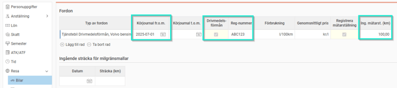
Inställningar för beräkning
Du behöver ställa in hur systemet ska beräkna förmånsvärdet. Det gör du under
Inställningar > Resa > Bilresor > Generellt
.
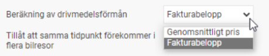
Fakturabelopp
Om du använder fakturabelopp kan förmånsvärdet variera månad för månad beroende på inköp och privata mil. Detta ger en exakt kostnad.
Systemet räknar ut värdet enligt formeln:
(a
n
t
a
l privata mil
/ totalt
an
tal körda mil
) x
F
akturabelopp x
1
.2
Genomsnittligt pris per liter
Om du väljer detta alternativ utgår systemet från de värden för bilens förbrukning och genomsnittligt literpris som du angett i personalregistret.
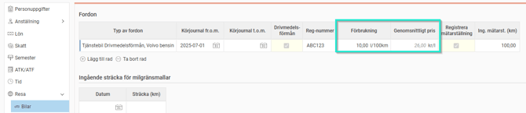
Om företaget har många likadana bilar kan du istället ange priset per fordonstyp under
Inställningar > Resa > Bilresor > Fordonstyper
. Då slår priset igenom på alla anställda som är kopplade till den fordonstypen.
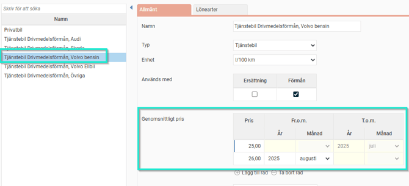
Registrera körda mil
Du väljer själv var de anställda ska registrera sina resor under
Inställningar > Resa > Bilresor > Generellt
.
Körjournal:
Resorna registreras enbart i vyn för körjournal.
Transaktionsvy:
Resorna registreras i den vanliga reseräkningsvyn. Det går fortfarande att se resorna i körjournalen, men de kan inte ändras eller raderas därifrån.
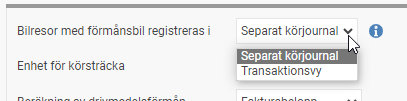
Registrera i Transaktionsvy
Här rapporterar du milen direkt i en reseräkning.
Om du har flera bilar, välj rätt bil i listan. Finns bara en bil väljs den automatiskt.
När du matar in sträckan ändras den utgående mätarställningen automatiskt. Du kan även välja att skriva in den utgående mätarställningen, så räknas sträckan fram åt dig.
Se till att alla reseräkningar med körda mil för perioden är klarmarkerade innan avräkning.

Registrera i separat Körjournal
Gå till vyn
Körjournal
.
Välj bil och ange rätt datumintervall.
Klicka på
Ny
för att påbörja registreringen.
Fyll i uppgifterna och klicka på
Spara
.
Se till att resorna är klarmarkerade innan avräkning.
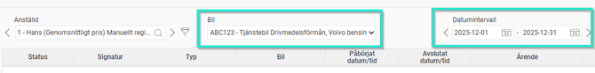
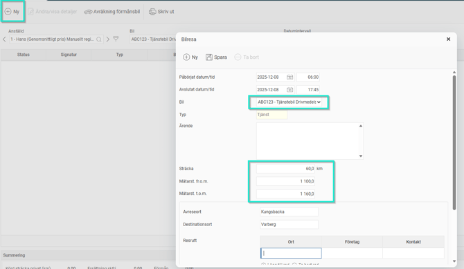
Avräkning av förmånsbil
När månaden är slut ska bilen avräknas för att räkna fram beloppen för drivmedelsförmånen. Detta görs alltid i vyn
Körjournal
, oavsett var resorna registrerades från början.
För anställda: Klarmarkera avräkning
Gå till
Resa > Körjournal
.
Välj den bil och period som ska avräknas.
Ange
Utgående mätarställning
per den sista i månaden.
Den privata körsträckan räknas ut med automatik.
Klicka på
Spara
och därefter
Klarmarkera
.
Om fakturabeloppet saknas får du en varning, men det går fortfarande att klarmarkera.
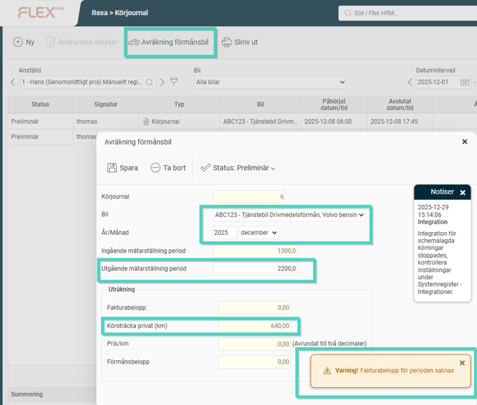
För administratörer: Registrera Fakturabelopp
För att färdigställa avräkningen behöver du mata in drivmedelskostnaden:
Gå till
Bearbetningar > Registrering av drivmedelsfakturor
.
Klicka på
Mata in nya drivmedelsfakturor
.
Ange fakturabeloppet för respektive anställd i listan.
Klicka på
Utför
och bekräfta med
Ja
.
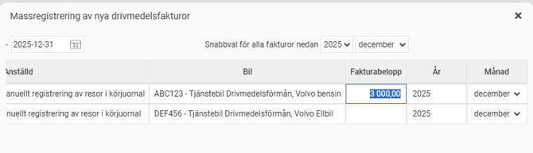
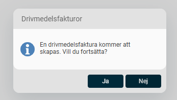
Avräkningen är nu klar och en drivmedelsförmån har skapats. Förmånsbeloppen bokförs mot de lönearter som är inställda under
Inställningar > Resa > Bilresor > Fordonstyper
.
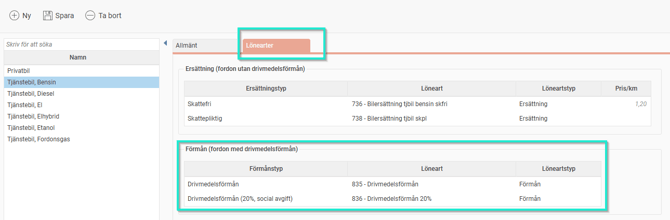
Attestera körjournalen
Som chef eller administratör attesterar du underlaget:
Gå till attestvyn. En ikon för körjournal visas vid den anställda.
Klicka på ikonen för att kontrollera uppgifterna.
Om fakturabeloppet är inmatat ser du de färdiga värdena under
Summering
.
Klicka på
Avräkning förmånsbil
för att godkänna, eller gå tillbaka till den vanliga attestvyn och attestera där.
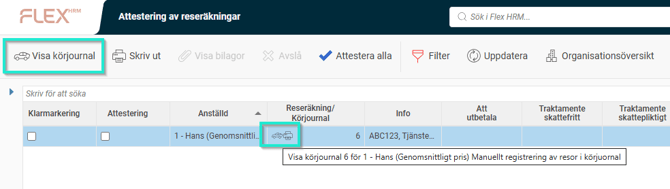
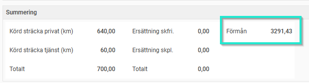
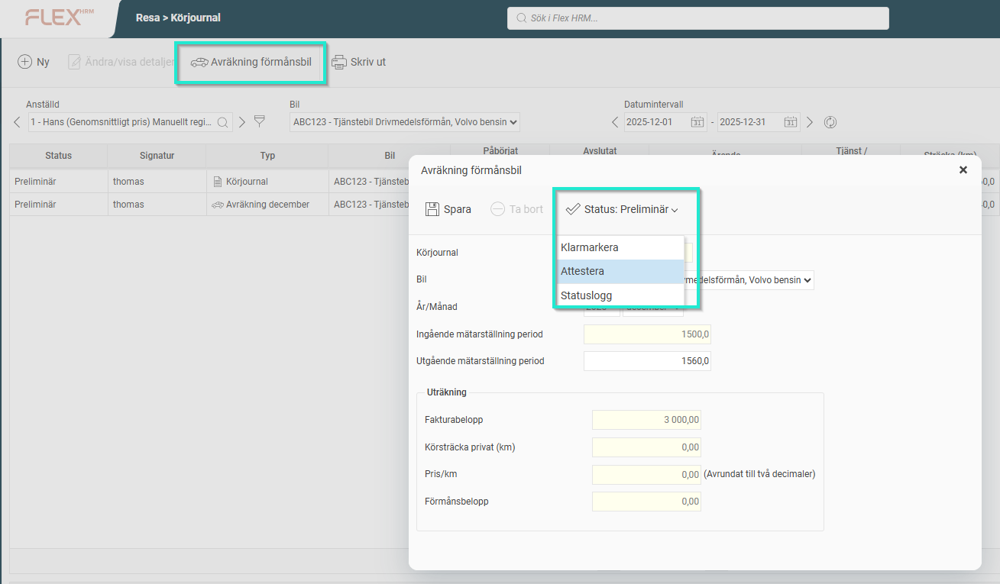
